# Data and RAG pipeline

This document describes the pipeline **currently implemented** by IRIS Electoral Intelligence, from official TSE and Chamber of Deputies data to grounded RAG answers. It complements the [README](README.md) with execution, contracts, persistence, idempotency, retrieval, and failure details.

> Real scope: no stage below assumes a service, index, or capability that is absent from the code. Current limitations and possible improvements are explicitly listed.

## End-to-end view

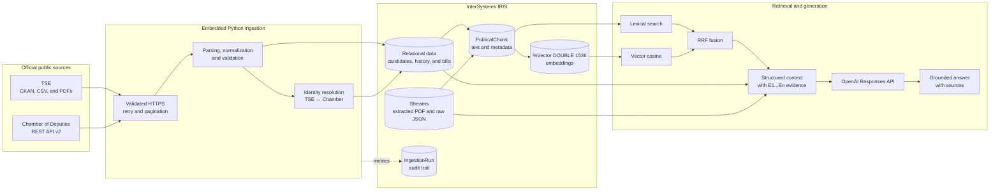

The orchestration command is:

```bash
docker compose exec iris irispython -m app.ingestion.pipeline
```

It runs **inside the IRIS container**, in namespace `IRISAPP`, and executes four auditable runs in a fixed order:

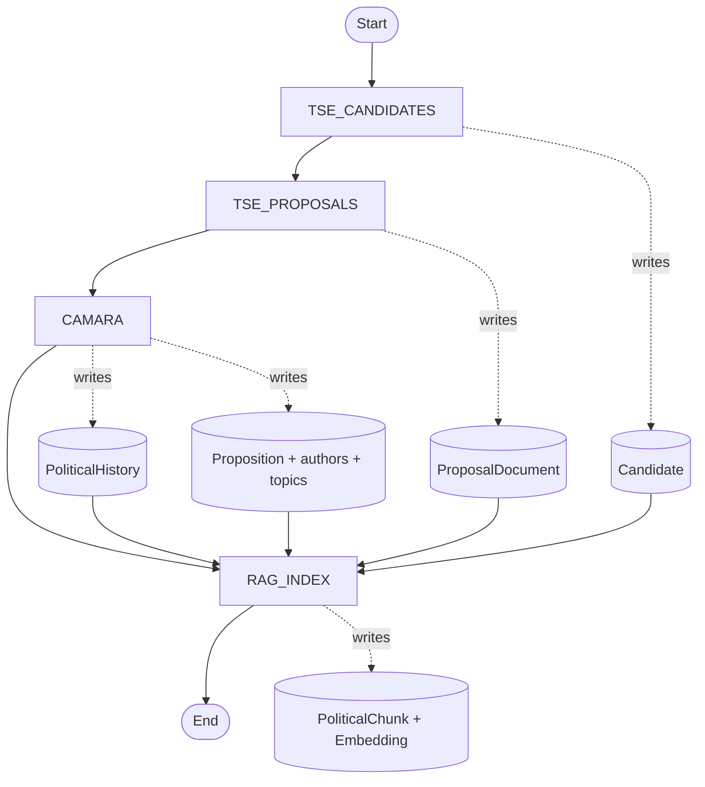

Each block has its own `IngestionRun`. A fatal exception ends it as `FAILED`; isolated recoverable failures produce `PARTIAL`; a run without failures is `SUCCESS`.

## Components and contracts

| Stage | Main implementation | Input | Output |
|---|---|---|---|
| Orchestration | `app/ingestion/pipeline.py` | Environment settings | Four ordered ingestion runs |
| Secure HTTP | `app/ingestion/http.py` | Official HTTPS URLs | Validated responses/files with retries |
| TSE candidates | `app/ingestion/tse/client.py`, `parser.py`, `mapper.py` | CKAN dataset and CSV | Normalized `Candidate` records |
| TSE programs | `proposal_reader.py` | Official ZIP/PDF resources | `ProposalDocument.RawText` |
| Chamber | `app/ingestion/camara/` | REST API v2 | Matching, history, bills, authors, and topics |
| Matching | `matching/candidate_matcher.py` | TSE candidate + Chamber members | `MATCHED`, `REVIEW`, or `UNMATCHED` |
| Chunking | `chunking/chunker.py`, `political_chunk_builder.py` | Persisted content | 700-token chunks with 100-token overlap |
| Embeddings | `app/embeddings/embedder.py` | Chunks without vectors | 1,536-dimensional embeddings |
| Persistence | `app/repositories/`, `app/database/` | Write models | IRIS persistent classes and audit trail |
| Retrieval | `app/retrieval/` | Question and filters | Lexical, vector, or structured evidence |
| RAG | `app/rag/` | Question + evidence | Controlled prompt, answer, and sources |

## Source collection and trust boundaries

The TSE integration uses CKAN to discover the `candidatos-2026` dataset, then reads the official candidate CSV and government-program PDF archives. Accepted hosts are `dadosabertos.tse.jus.br` and `cdn.tse.jus.br`. The Chamber integration uses `dadosabertos.camara.leg.br/api/v2` for member records, mandates, bills, authors, and topics. HTTPS is mandatory.

The HTTP layer validates the initial URL and every redirect, requires an object at the root of JSON responses, streams downloads to temporary files, and computes SHA-256 while downloading. ZIP signatures and member paths are checked before extraction to prevent zip-slip attacks.

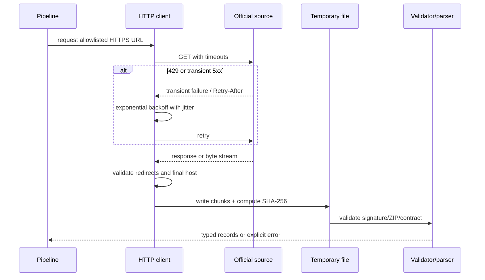

Retries cover connection errors, timeouts, `429`, `500`, `502`, `503`, and `504`. Defaults are a 10-second connect timeout, a 60-second read timeout, and four total attempts. Numeric `Retry-After` is honored; otherwise, exponential waiting with jitter is used.

## Stage 1 — TSE candidates

The client calls CKAN `package_show`, validates the response with Pydantic, and selects exactly one active candidate CSV resource. The download receives a SHA-256 hash and ZIP validation. A nationwide CSV containing `BRASIL` is preferred; otherwise, the available CSV members are considered.

The parser requires the official columns, reads Latin-1 with `;` as the delimiter, and normalizes known null sentinels. Invalid rows are counted as failed instead of becoming partial candidate records. Valid rows are filtered by election year, state, and office. Defaults are 2026, SP, and `DEPUTADO FEDERAL,GOVERNADOR`.

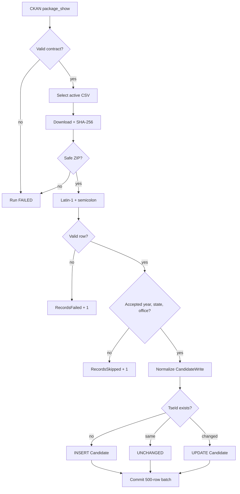

`Candidate.TseId` has a unique index and drives idempotent upserts. Records are persisted in batches of 500; data and aggregated counters share the same transaction.

The HTTP download is streamed, but the candidate parser currently materializes its parsed result before persistence. **End-to-end CSV streaming is not currently implemented.**

## Stage 2 — TSE government programs

The pipeline selects active PDF resources for the configured year and accepted `BR`/state prefixes. ZIP archives are downloaded, hashed, and validated. A filename regular expression extracts year, state, and `SQ_CANDIDATO`; candidate association is exact and never inferred from a similar name.

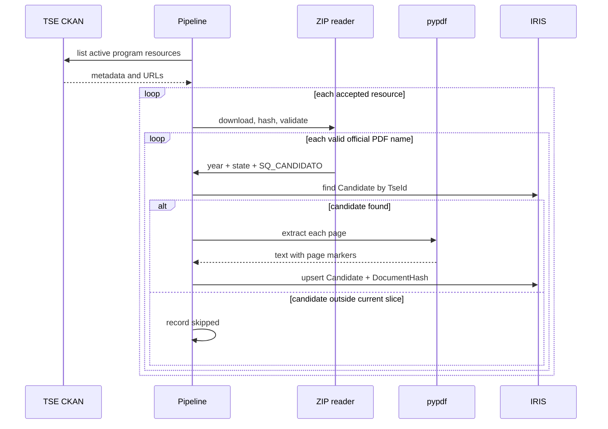

`pypdf` extracts page text and adds `[Página N]` markers. The SHA-256 of the original PDF bytes becomes `DocumentHash`. Full text is stored in `ProposalDocument.RawText`, a `%Stream.GlobalCharacter`; derived embeddings belong to `PoliticalChunk`, not to the document row.

The application upserts on `(Candidate, DocumentHash)`. **OCR is not currently implemented**, so scanned PDFs without a text layer can be empty or incomplete.

## Stage 3 — Chamber matching and parliamentary data

Identity resolution is deterministic and auditable. It searches by ballot/civil name, falls back to first-plus-last name when needed, and scores available evidence:

| Evidence | Points |
|---|---:|
| Verified manual override | 100 |
| Exact civil name | 60 |
| Exact ballot name | 20 |
| Matching state | 15 |
| Matching historical party | 5 |

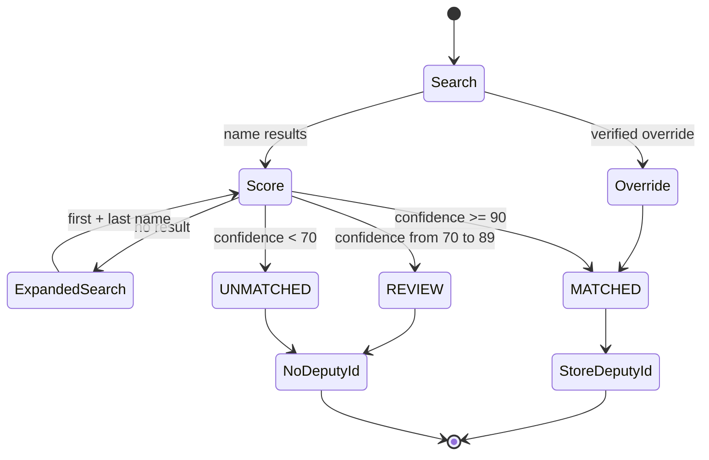

`REVIEW` is never automatically promoted. Only `MATCHED` records retain a `CamaraDeputyId` and proceed to detailed parliamentary collection.

For each match, the pipeline caches member details/history, retains current history and external mandates that overlap the lookback interval, and searches bills in reverse three-month windows. API pagination follows `rel=next` after validating each next URL. Bill IDs are deduplicated before limits are applied.

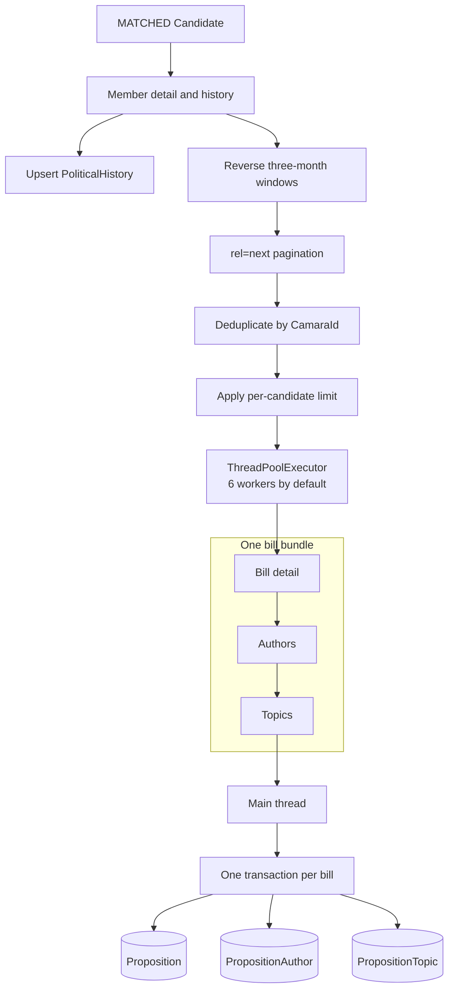

Each worker owns its HTTP session. Concurrency is between bills; detail, author, and topic calls for one bill remain sequential. The main thread serializes database writes. One bill failure increments `RecordsFailed`, lets other work continue, and makes the run `PARTIAL`.

Deduplication keys are the official `CamaraId` for bills, URI or normalized name/type for authors, `(Proposition, Name)` for topics, and `(Candidate, ExternalId)` in the history repository. Defaults cap detailed collection at 50 matched candidates, 50 bills per candidate, and 10 authors per bill.

## Multimodel persistence in InterSystems IRIS

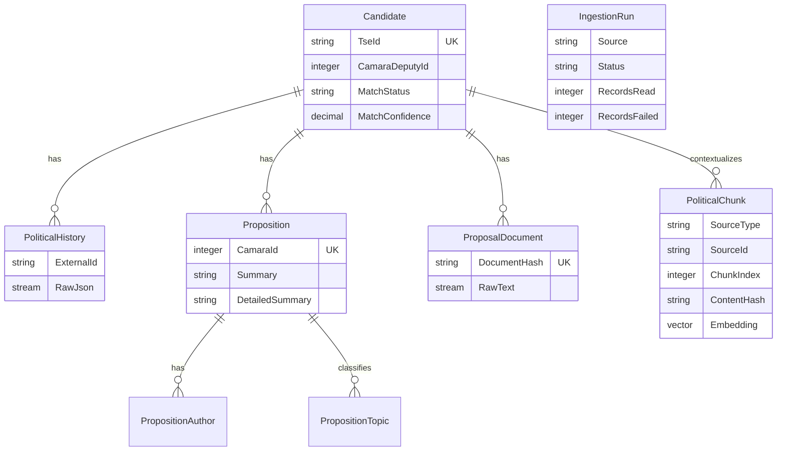

Eight `%Persistent` classes combine relational/object data, `%Stream.GlobalCharacter`, and fixed-length `%Vector` properties. Classes are compiled while building the IRIS image. Runtime access uses `iris.sql` from Embedded Python; hybrid access uses the Object API for `Candidate` and `IngestionRun` and parameterized SQL for the other models. Transactions are explicit.

## Stage 4 — chunking and embeddings

`RAG_INDEX` produces three source types:

| `SourceType` | Source | `SourceId` | Rendered text |
|---|---|---|---|
| `PROPOSITION` | Bill + authors + topics | `CamaraId` | title, authors, topics, summaries, status |
| `GOVERNMENT_PROPOSAL` | `ProposalDocument` | PDF SHA-256 | full extracted text with page markers |
| `POLITICAL_HISTORY` | `PoliticalHistory` | `ExternalId` | institution, role, party, dates, status |

The pipeline repairs invalid bill years when presentation dates make that possible. It loads author/topic context using `IN` queries capped at 200 IDs to avoid IRIS argument-stack limits.

### Token windows

Text is normalized and tokenized using the configured model encoding, with `cl100k_base` as fallback. Windows contain 700 tokens, overlap by 100, and therefore advance by 600. Each decoded chunk is capped at 32,000 characters. A SHA-256 is computed from normalized content. PDF metadata includes start/end pages when markers occur in the window.

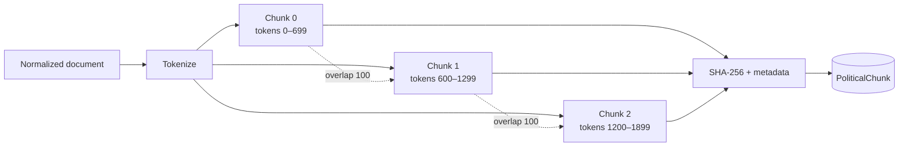

The 700-token window keeps enough legislative/program context without turning an evidence item into an overly broad document. A 100-token overlap protects arguments split across boundaries. Both settings are configurable and should be tuned through precision, coverage, latency, and cost measurements as the corpus grows.

### Idempotent source replacement

For each `(Candidate, SourceType, SourceId)`, `replace_source` compares `(ChunkIndex, ContentHash)`. Equal chunks keep their existing vector, stale chunks are removed, and new/changed chunks are inserted without an embedding. Only rows with `Embedding IS NULL` are subsequently sent to the embedding model.

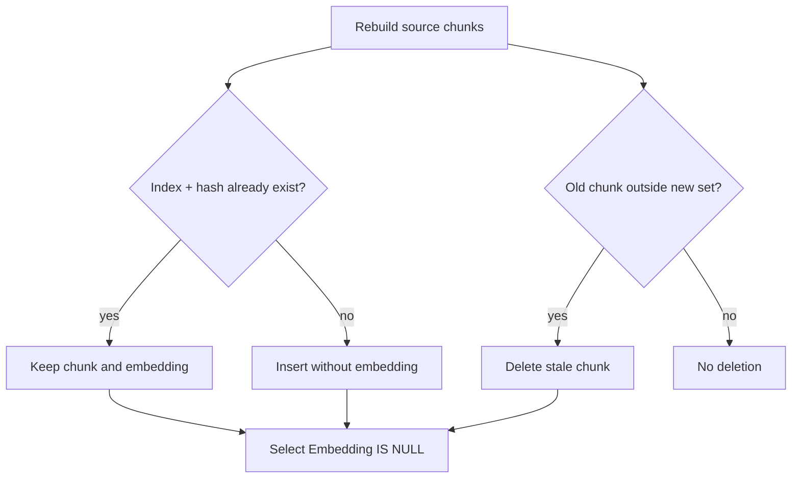

The current process still rereads and reconstructs sources before comparison. **A per-source incremental checkpoint is not currently implemented.**

### Embedding contract

- Default model: `text-embedding-3-small`.
- Requested and validated dimension: 1,536.
- Default API batch: 50 chunks.
- Storage: `PoliticalChunk.Embedding As %Vector(DATATYPE="DOUBLE", LEN=1536)`.
- SQL conversion: `TO_VECTOR(?, DOUBLE)`.

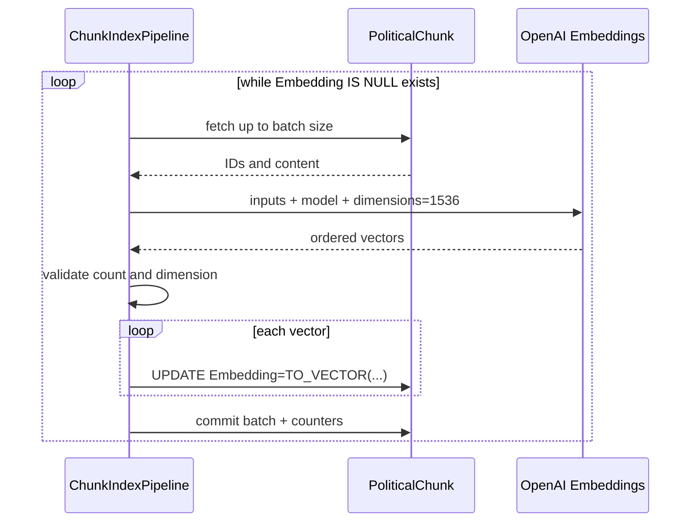

If pending chunks exist without `LLM_API_KEY`, no fake vector is generated: `RAG_INDEX` ends as `PARTIAL` and records the pending count. A count or dimension mismatch is an error.

`PoliticalChunk` is the authoritative vector table. A complete index must produce zero pending rows:

```sql
SELECT COUNT(*) AS TotalChunks,
       SUM(CASE WHEN Embedding IS NULL THEN 1 ELSE 0 END) AS PendingEmbeddings
FROM IRISPolitical_Model.PoliticalChunk;
```

## Structured and hybrid retrieval

The deterministic query planner chooses between structured document coverage, structured topic-frequency aggregation, and hybrid retrieval.

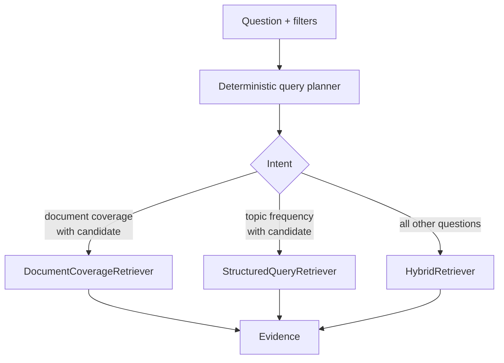

Document coverage samples positions distributed across an ordered document instead of overrepresenting its beginning. Topic frequency uses an exact SQL `COUNT` over proposition topics.

The lexical branch loads eligible chunks from IRIS, normalizes accents/case in Python, and scores full-phrase hits ten times plus term occurrences. Its top 20 enter the fusion. **An IRIS full-text index is not currently implemented.**

The vector branch embeds the query with the same model/dimension and asks IRIS for the top 20 using:

```sql
VECTOR_COSINE(Embedding, TO_VECTOR(?, DOUBLE))
```

**An HNSW index is not currently implemented.** Vector similarity operates over the filtered records.

The two rankings are merged by Reciprocal Rank Fusion:

```text
RRF(d) = Σ 1 / (60 + rank(d))
```

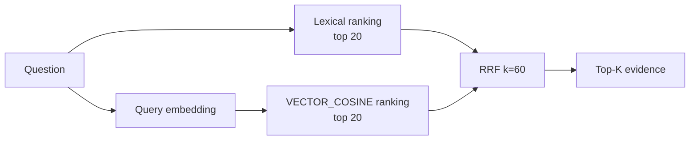

Rank fusion avoids treating text frequency and cosine similarity as if their raw scores had the same scale.

## Context, prompt, and answer generation

`/search` returns retrieval results only. `/ask` continues through the RAG generation path.

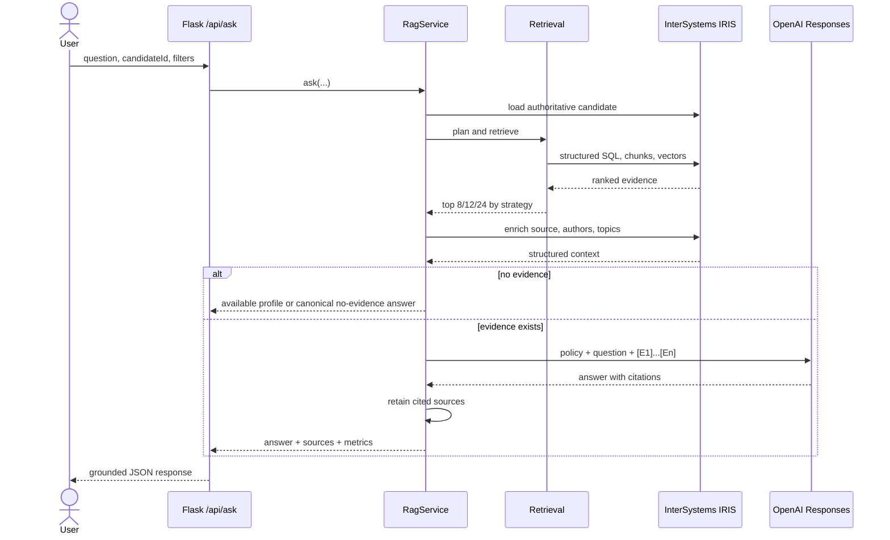

Normal retrieval uses eight items; selected-candidate document coverage uses 12; global discovery retrieves up to 24 and diversifies to 12, with at most three items per candidate. When a `candidateId` is supplied, evidence from other candidates is rejected.

The context combines each chunk with authoritative candidate/source records, authors, topics, official source URL, and collection metadata. Evidence is labeled `[E1]`, `[E2]`, and so on.

Prompt policy requires neutral Brazilian Portuguese, evidence-only claims, `[E#]` citations, explicit distinction between missing context and a negative fact, no voting advice or inferred ideology, and rejection of instructions found inside retrieved documents. External text is evidence, never an instruction.

Generation uses the OpenAI Responses API with `store=False`, default model `gpt-5-mini`, and an initial 4,000-token output cap. One retry is allowed for empty/incomplete output with a larger cap, up to 8,000. If that still fails, a deterministic evidence summary is returned. The LLM is not called when there is no evidence.

Returned sources are normally restricted to citations present in the answer. If no recognizable citation is emitted, all evidence supplied to the model remains attached for traceability.

## Transactions and audit states

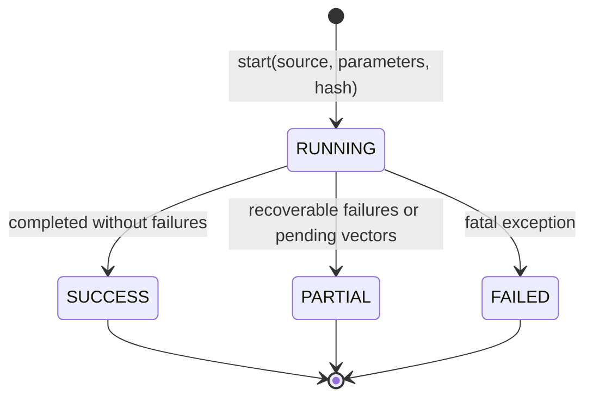

`IngestionRun` records start/end times, source, status, SHA-256 where applicable, JSON parameters, error text, and read/created/updated/skipped/failed counters. Counters are accumulated in memory and flushed at the corresponding data transaction boundary.

Main boundaries are one transaction per 500 TSE candidates, one per government-program PDF, small candidate/history transactions, one per Chamber bill including authors/topics, one per chunk source, and one per embedding batch. A rollback affects the current unit only, so confirmed work can be safely revisited through idempotent upserts.

## Operational configuration

| Variable | Default | Effect |
|---|---:|---|
| `INGEST_ELECTION_YEAR` | `2026` | Accepted election year |
| `INGEST_STATES` | `SP` | Accepted comma-separated states |
| `INGEST_OFFICES` | `DEPUTADO FEDERAL,GOVERNADOR` | Accepted offices |
| `CAMARA_LOOKBACK_YEARS` | `4` | Moving history interval |
| `CAMARA_MAX_MATCHED_CANDIDATES` | `50` | Candidates receiving detailed Chamber data |
| `CAMARA_MAX_PROPOSITIONS_PER_CANDIDATE` | `50` | Bills per candidate |
| `CAMARA_MAX_AUTHORS_PER_PROPOSITION` | `10` | Authors per bill |
| `CAMARA_HTTP_WORKERS` | `6` | Bill concurrency, from 1 to 16 |
| `HTTP_CONNECT_TIMEOUT_SECONDS` | `10` | Connect timeout |
| `HTTP_READ_TIMEOUT_SECONDS` | `60` | Read timeout |
| `HTTP_MAX_RETRIES` | `4` | Total attempts |
| `CHUNK_SIZE_TOKENS` | `700` | Target chunk size |
| `CHUNK_OVERLAP_TOKENS` | `100` | Window overlap |
| `EMBEDDING_MODEL` | `text-embedding-3-small` | Vector model |
| `EMBEDDING_BATCH_SIZE` | `50` | Chunks per API call |
| `LLM_MODEL` | `gpt-5-mini` | Generation model |
| `LLM_MAX_OUTPUT_TOKENS` | `4000` | Initial response cap |

See the [README](README.md) for the complete environment reference and clean installation commands.

## Execution and validation

With a healthy environment:

```bash
docker compose exec iris irispython -m app.ingestion.pipeline
```

Check API availability:

```bash
curl http://localhost:52773/api/health
curl http://localhost:52773/api/candidates
```

Inspect runs and vectors in IRIS SQL:

```sql
SELECT ID, Source, Status, RecordsRead, RecordsCreated,
       RecordsUpdated, RecordsSkipped, RecordsFailed, StartedAt, FinishedAt
FROM IRISPolitical_Model.IngestionRun
ORDER BY ID DESC;

SELECT SourceType,
       COUNT(*) AS Chunks,
       SUM(CASE WHEN Embedding IS NULL THEN 1 ELSE 0 END) AS Pending
FROM IRISPolitical_Model.PoliticalChunk
GROUP BY SourceType;
```

A complete vector index requires `Pending = 0` for every present source type. A `PARTIAL` or `FAILED` run must be explained through `ErrorMessage` and logs before the environment is considered valid.

### Validated-run snapshot

One clean validation run persisted 1,139 candidates, 399 history rows, 2,753 bills, 7,351 authors, 1,866 topics, 20 program documents, and 4,425 chunks. All 4,425 chunks had a non-null embedding, and a `VECTOR_COSINE` query completed successfully. This is a dated snapshot, not a fixed contract; counts vary with filters, limits, execution date, and upstream public data.

## Current limitations and future work

| Capability | Actual status |
|---|---|
| Foreign Tables | **Not currently implemented.** Sources are fetched over HTTPS and persisted by application classes. |
| HNSW index | **Not currently implemented.** `%Vector` and `VECTOR_COSINE` are used without ANN indexing. |
| IRIS full-text index | **Not currently implemented.** Lexical ranking runs in Python. |
| OCR | **Not currently implemented.** PDF extraction depends on a text layer. |
| End-to-end CSV streaming | **Not currently implemented.** Downloads stream, but parsed rows are materialized. |
| Per-source incremental checkpoint | **Not currently implemented.** Upserts/hashes make reruns idempotent, but sources are reread/rebuilt. |
| Production scheduler | **Not currently implemented.** Ingestion is command-driven. |
| IRIS interoperability, Business Rules, IntegratedML | **Not currently implemented.** |
| Automated retrieval evaluation | **Future improvement.** Add a query set, recall/nDCG, and citation regression tests. |
| Index optimization | **Future improvement.** Benchmark HNSW/full-text as the corpus grows without changing retrieval semantics. |

## Demonstrated IRIS capabilities

The implemented pipeline provides verifiable evidence of eight `%Persistent` classes, relationships and unique indexes, relational SQL and Object API use in Embedded Python, `%Stream.GlobalCharacter`, fixed-dimension `%Vector`, `VECTOR_COSINE`, explicit transactions, auditable ingestion runs, and multimodel storage used by both the API and RAG. Flask is served by IRIS native WSGI at `/api`.

This supports the contest areas for RAG, Hybrid Search, public APIs, explicit chunking/embedding design, and multimodel data while avoiding claims for unimplemented features. See the official [InterSystems Programming Contest 2026 rules](https://pt.community.intersystems.com/post/concurso-de-programa%C3%A7%C3%A3o-da-comunidade-de-desenvolvedores-da-intersystems-pt-2026).
