# Pipeline de dados e RAG

Este documento descreve o fluxo **implementado atualmente** no IRIS Electoral Intelligence: da coleta de dados públicos do TSE e da Câmara dos Deputados até a resposta RAG fundamentada. Ele complementa o [README](README.md) com detalhes de execução, contratos, persistência, idempotência, recuperação e falhas.

> Escopo real: nenhuma etapa abaixo pressupõe serviços, índices ou recursos não presentes no código. Limitações e evoluções possíveis estão identificadas no final.

## Visão geral

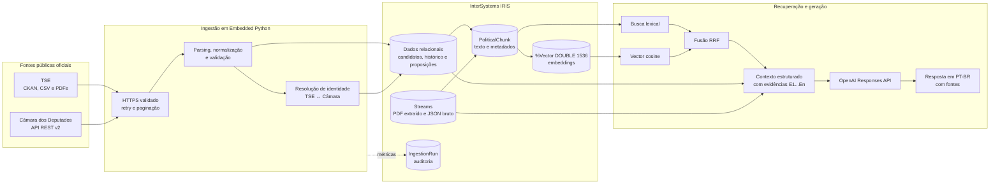

O comando de orquestração é:

```bash
docker compose exec iris irispython -m app.ingestion.pipeline
```

Ele é executado **dentro do container IRIS**, no namespace `IRISAPP`, e segue esta ordem fixa:

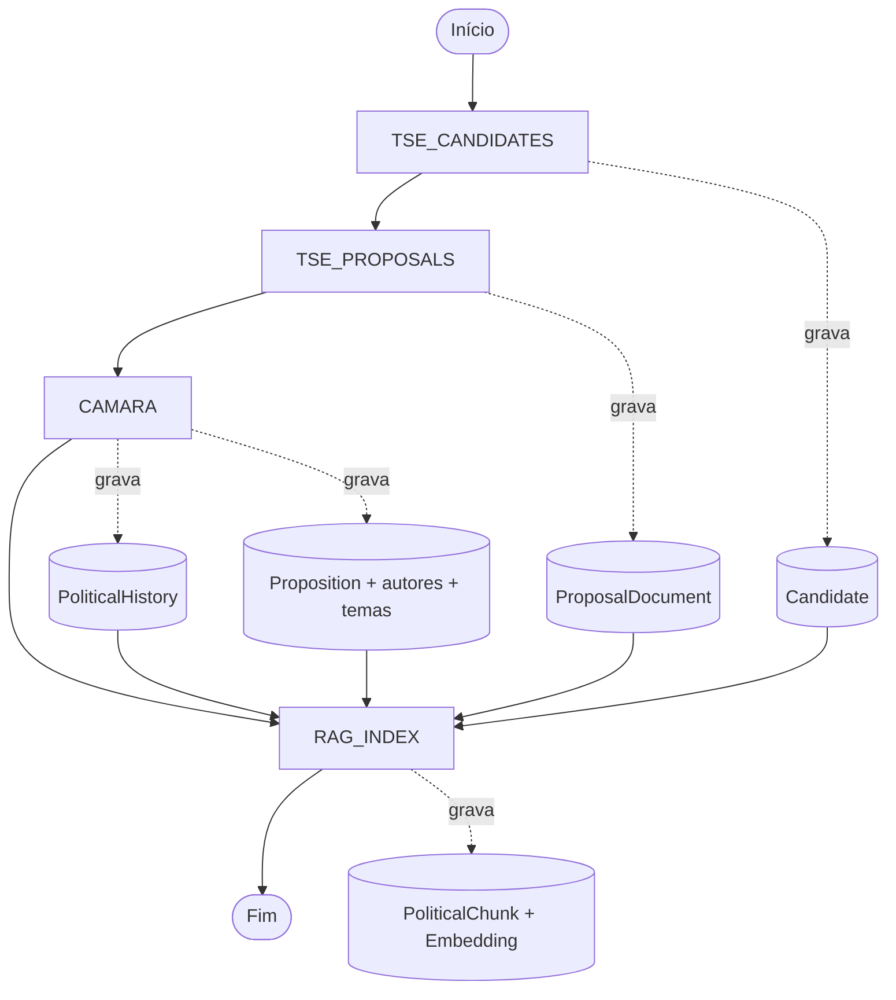

Cada bloco possui seu próprio registro em `IngestionRun`. Uma falha fatal encerra o bloco como `FAILED`; falhas isoladas que permitem continuação produzem `PARTIAL`; ausência de falhas produz `SUCCESS`.

## Componentes e responsabilidades

| Etapa | Implementação principal | Entrada | Saída |
|---|---|---|---|
| Orquestração | `app/ingestion/pipeline.py` | Configurações de ambiente | Quatro runs de ingestão em ordem |
| HTTP seguro | `app/ingestion/http.py` | URLs oficiais HTTPS | Respostas/arquivos validados, com retry |
| TSE: candidatos | `app/ingestion/tse/client.py`, `parser.py`, `mapper.py` | Dataset CKAN e CSV | `Candidate` normalizado |
| TSE: planos | `proposal_reader.py` | ZIPs/PDFs oficiais | `ProposalDocument.RawText` |
| Câmara | `app/ingestion/camara/` | API REST v2 | Matching, histórico, proposições, autores e temas |
| Matching | `matching/candidate_matcher.py` | Candidato TSE + deputados Câmara | `MATCHED`, `REVIEW` ou `UNMATCHED` |
| Chunking | `chunking/chunker.py`, `political_chunk_builder.py` | Conteúdo persistido | Chunks de 700 tokens, overlap 100 |
| Embeddings | `app/embeddings/embedder.py` | Chunks sem vetor | Vetores `text-embedding-3-small`, 1536 dimensões |
| Persistência | `app/repositories/`, `app/database/` | Objetos de escrita | Classes persistentes IRIS e auditoria |
| Retrieval | `app/retrieval/` | Pergunta e filtros | Evidências lexicais, vetoriais ou estruturadas |
| RAG | `app/rag/` | Pergunta + evidências | Prompt controlado, resposta e fontes |

## Fontes externas e fronteiras de confiança

### TSE

- API CKAN: descoberta do dataset `candidatos-2026` e de seus recursos.
- CSV oficial de candidaturas: codificação Latin-1 e separador `;`.
- ZIPs de propostas de governo: PDFs associados pelo `SQ_CANDIDATO` codificado no nome oficial do arquivo.
- Hosts aceitos: `dadosabertos.tse.jus.br` e `cdn.tse.jus.br`, sempre por HTTPS.

### Câmara dos Deputados

- API Dados Abertos v2: deputados, detalhes, histórico, mandatos externos, proposições, autores e temas.
- Host aceito: `dadosabertos.camara.leg.br`, sempre por HTTPS.
- A janela histórica padrão é móvel e cobre os quatro anos anteriores à data da execução.

O cliente valida a URL inicial e cada redirecionamento. Respostas JSON precisam ter um objeto na raiz. Downloads são feitos em arquivo temporário e recebem SHA-256 durante a transferência. ZIPs passam por validação de assinatura e proteção contra *zip slip* antes de qualquer leitura.

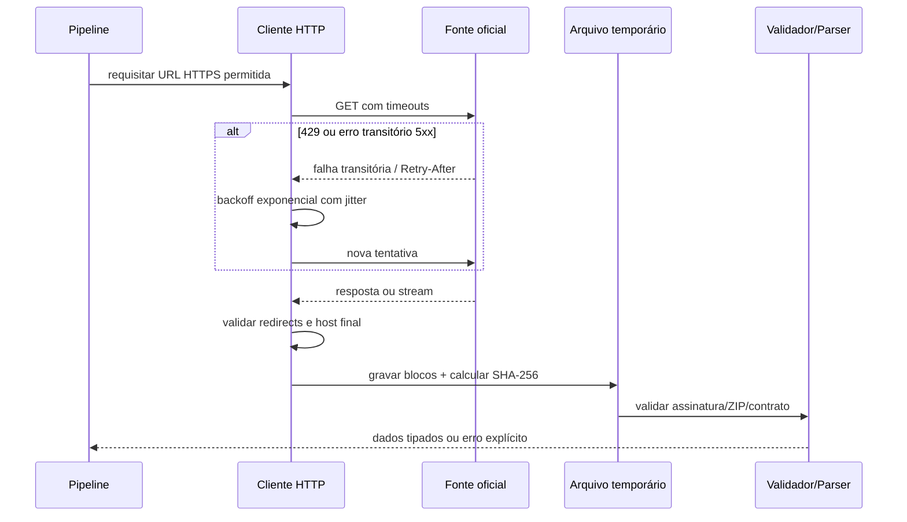

As falhas que recebem retry são conexão, timeout, HTTP `429`, `500`, `502`, `503` e `504`. Os padrões são timeout de conexão de 10 s, leitura de 60 s e até quatro tentativas. `Retry-After` numérico é respeitado; nos demais casos usa-se espera exponencial com jitter.

## Etapa 1 — candidatos do TSE

### Descoberta e seleção do recurso

1. Consulta `package_show` no CKAN.
2. Exige `success=true` e identidade compatível com o dataset solicitado.
3. Valida o contrato com Pydantic.
4. Seleciona exatamente um recurso CSV ativo cujo nome identifique candidatos.
5. Baixa o arquivo, calcula SHA-256 e valida o ZIP.
6. Prefere o CSV nacional que contém `BRASIL` no nome; na ausência dele, considera os CSVs encontrados.

### Parsing e normalização

O parser exige as colunas oficiais necessárias, lê Latin-1 com delimitador `;` e converte sentinelas de nulo. Linhas inválidas viram resultados de parsing com erro e entram no contador `RecordsFailed`; não são transformadas em candidatos parciais.

O pipeline filtra:

- ano eleitoral (`INGEST_ELECTION_YEAR`, padrão `2026`);
- UFs (`INGEST_STATES`, padrão `SP`);
- cargos (`INGEST_OFFICES`, padrão `DEPUTADO FEDERAL,GOVERNADOR`).

Os registros válidos são persistidos em lotes de 500. Cada lote e a atualização agregada dos contadores compartilham a mesma transação.

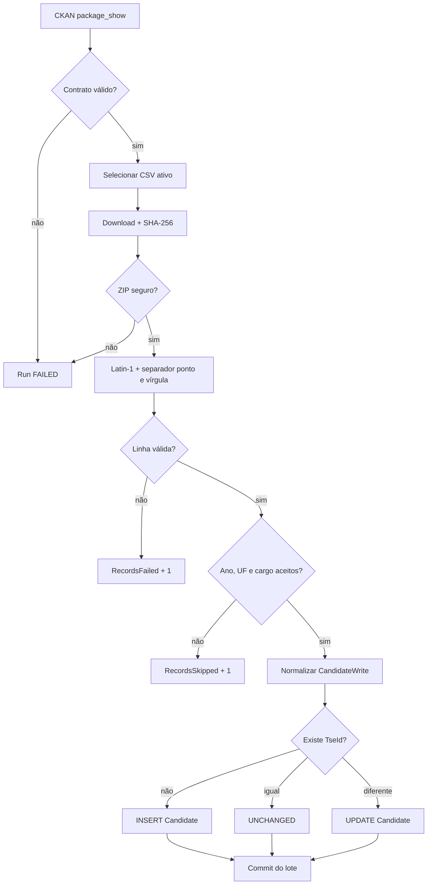

### Idempotência

`Candidate.TseId` possui índice único. O repositório pesquisa esse identificador antes de escrever:

- não existe: `INSERTED`;
- existe e os campos de negócio são iguais: `UNCHANGED`;
- existe e mudou: `UPDATED`.

O parser atualmente materializa as linhas em memória antes da persistência. Portanto, **streaming ponta a ponta do CSV não está implementado atualmente**.

## Etapa 2 — propostas de governo do TSE

O pipeline seleciona recursos PDF ativos do ano eleitoral cujos nomes correspondem a `BR`, às UFs configuradas e ao sufixo “proposta de governo”. Os recursos podem conter ZIPs com vários PDFs.

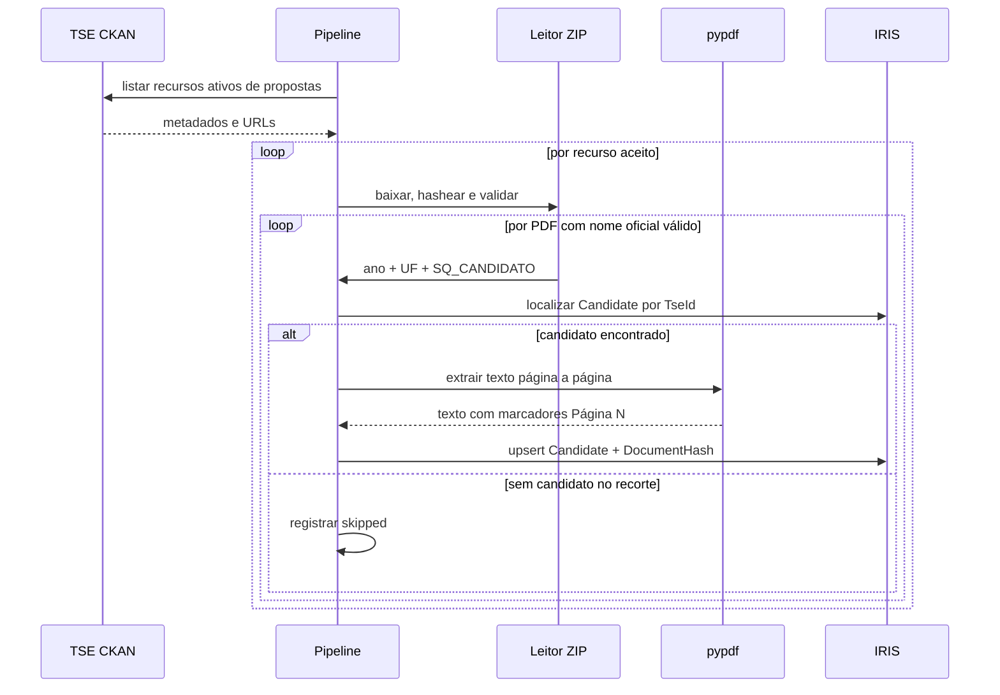

O nome do arquivo é interpretado por expressão regular no formato oficial, extraindo ano, UF e `SQ_CANDIDATO`. O vínculo é exato pelo identificador do TSE: não há aproximação por nome nessa etapa.

O `pypdf` extrai o texto de cada página e adiciona marcadores `[Página N]`. O SHA-256 dos bytes do PDF vira `DocumentHash`. O texto integral vai para `ProposalDocument.RawText`, um `%Stream.GlobalCharacter`; os embeddings não são armazenados no documento, mas nos chunks derivados.

Idempotência: a chave única lógica é `(Candidate, DocumentHash)`. O mesmo conteúdo não cria outro documento; mudanças nos metadados atualizam o registro existente.

Limitação: **OCR de PDFs digitalizados não está implementado atualmente**. PDFs sem camada textual podem resultar em conteúdo vazio ou incompleto.

## Etapa 3 — Câmara e resolução de identidade

Relacionar uma candidatura eleitoral a um deputado exige cuidado: nomes de urna, nomes civis e filiações históricas podem divergir. O pipeline não usa uma aproximação opaca. Ele aplica regras determinísticas, guarda a confiança técnica e só ingere dados parlamentares quando o resultado é `MATCHED`.

### Pontuação do matching

| Evidência | Pontos |
|---|---:|
| Override manual verificado | 100 |
| Nome civil exato | 60 |
| Nome de urna exato | 20 |
| UF compatível | 15 |
| Partido compatível no histórico | 5 |

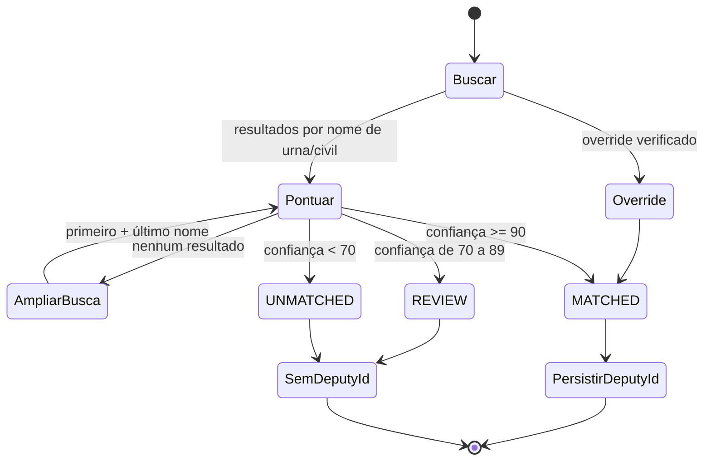

`REVIEW` não é promovido automaticamente. Para `REVIEW` e `UNMATCHED`, `CamaraDeputyId` permanece nulo e não há coleta detalhada daquele deputado.

### Coleta parlamentar

Para cada candidato `MATCHED`, o pipeline:

1. obtém detalhes e histórico do deputado, com cache por ID;
2. preserva registros atuais dentro da janela e mandatos externos que se sobreponham à janela;
3. busca proposições em janelas reversas de três meses;
4. segue o link `rel=next` da API e valida cada próxima URL;
5. elimina IDs repetidos e aplica o limite configurado por candidato;
6. coleta detalhes, autores e temas de diferentes proposições em paralelo;
7. serializa as gravações no thread principal, em uma transação por proposição.

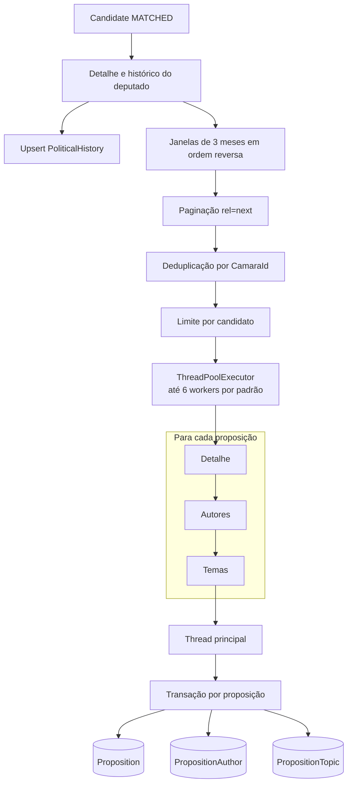

Cada worker mantém sua própria sessão HTTP. O paralelismo ocorre entre proposições; as três chamadas de uma mesma proposição são sequenciais. Uma falha isolada incrementa `RecordsFailed`, permite as demais coletas e deixa a run `PARTIAL`.

### Deduplicação

- `Proposition.CamaraId`: único; upsert pelo ID oficial.
- Autores: deduplicados por URI quando disponível, senão por nome normalizado e tipo.
- Temas: únicos por `(Proposition, Name)`.
- Histórico: upsert por `(Candidate, ExternalId)` na aplicação.
- O número máximo padrão é 50 candidatos correspondidos, 50 proposições por candidato e 10 autores por proposição.

## Persistência multimodelo no InterSystems IRIS

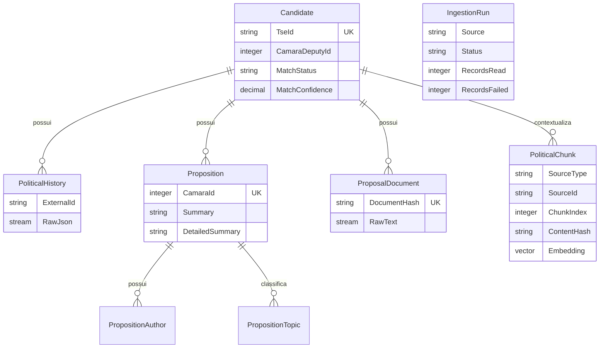

O IRIS centraliza três representações complementares:

- **relacional/objetos persistentes:** candidatos, vínculos, proposições, autores e temas;
- **streams:** texto integral dos PDFs e JSON bruto de histórico para auditoria;
- **vetores:** embeddings de dimensão fixa em `PoliticalChunk.Embedding`.

As oito classes `%Persistent` são compiladas no build da imagem. O acesso usa `iris.sql` no Embedded Python; o modo híbrido utiliza a Object API para `Candidate` e `IngestionRun` e SQL parametrizado para as demais entidades. As transações são explícitas.

## Etapa 4 — chunking e embeddings

O `RAG_INDEX` transforma três fontes em `PoliticalChunk`:

| `SourceType` | Origem | `SourceId` | Texto construído |
|---|---|---|---|
| `PROPOSITION` | `Proposition` + autores + temas | `CamaraId` | título, autores, temas, ementas e situação |
| `GOVERNMENT_PROPOSAL` | `ProposalDocument` | SHA-256 do PDF | texto integral com marcadores de página |
| `POLITICAL_HISTORY` | `PoliticalHistory` | `ExternalId` | instituição, cargo, partido, período e situação |

Antes de chunkear, o pipeline corrige anos inválidos de proposições quando a data de apresentação permite a recuperação. Autores e temas são lidos com consultas `IN` em blocos de no máximo 200 IDs para respeitar limites de argumentos do IRIS.

### Algoritmo de chunking

1. Normaliza quebras de linha e espaços horizontais.
2. Tokeniza com o encoding do modelo configurado; usa `cl100k_base` como fallback.
3. Cria janelas de 700 tokens.
4. Reaproveita 100 tokens da janela anterior; o passo efetivo é 600.
5. Limita o texto decodificado a 32.000 caracteres, compatível com a propriedade IRIS.
6. Calcula SHA-256 do conteúdo normalizado.
7. Registra metadados JSON e, para PDFs, páginas inicial/final quando os marcadores aparecem no chunk.

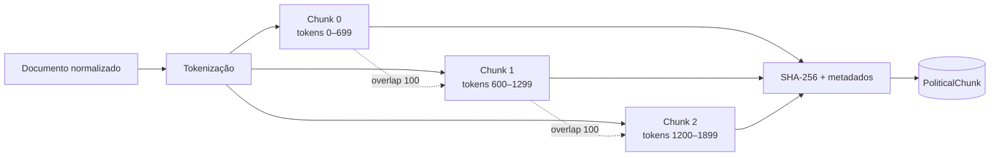

O tamanho de 700 tokens oferece contexto suficiente para trechos legislativos e programáticos sem transformar cada evidência em um documento muito amplo. A sobreposição de 100 tokens reduz a perda de frases e argumentos nas fronteiras. Esses valores são configuráveis por `CHUNK_SIZE_TOKENS` e `CHUNK_OVERLAP_TOKENS` e devem ser reavaliados por experimentos de precisão, cobertura, latência e custo quando o corpus crescer.

### Substituição idempotente da fonte

Para cada `(Candidate, SourceType, SourceId)`, `replace_source` compara `(ChunkIndex, ContentHash)`:

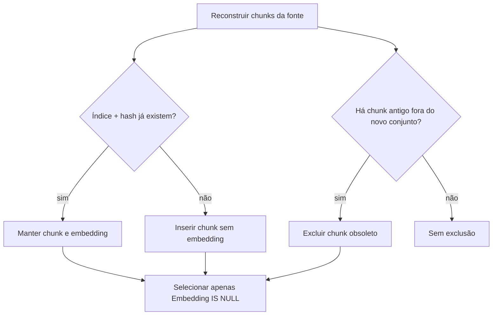

Assim, uma reexecução reconstrói a representação textual, mas preserva vetores de chunks cujo índice e conteúdo não mudaram. Chunks novos ou alterados ficam pendentes. Não existe atualmente checkpoint por fonte que evite a reconstrução antes dessa comparação.

### Geração e armazenamento dos embeddings

- Modelo padrão: `text-embedding-3-small`.
- Dimensão solicitada e validada: 1536.
- Lote padrão: 50 chunks.
- Chamada: OpenAI Embeddings API.
- Destino: `PoliticalChunk.Embedding As %Vector(DATATYPE="DOUBLE", LEN=1536)`.
- Escrita: `TO_VECTOR(?, DOUBLE)` em SQL parametrizado.

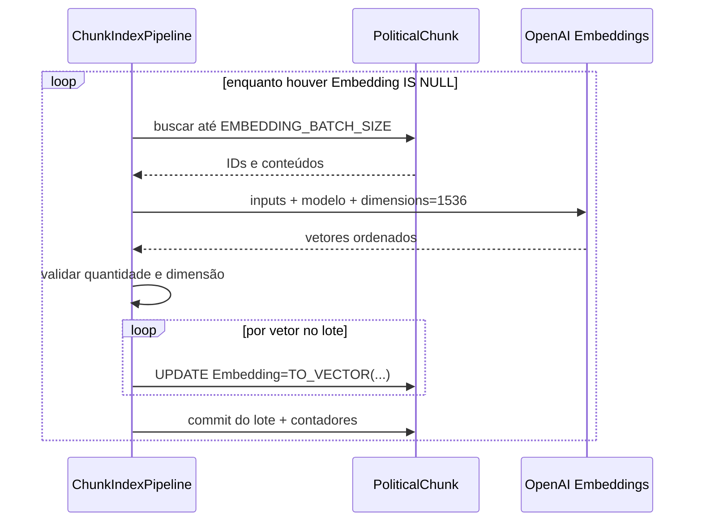

Se houver chunks pendentes e `LLM_API_KEY` estiver ausente, o pipeline não fabrica vetores: encerra `RAG_INDEX` como `PARTIAL` e registra a quantidade pendente. Resposta com número de vetores diferente do lote ou dimensão diferente de 1536 é erro.

`PoliticalChunk` é, portanto, a tabela responsável pela representação vetorial. A condição operacional esperada após uma indexação completa é:

```sql
SELECT COUNT(*) AS TotalChunks,
       SUM(CASE WHEN Embedding IS NULL THEN 1 ELSE 0 END) AS PendingEmbeddings
FROM IRISPolitical_Model.PoliticalChunk;
```

`PendingEmbeddings` deve ser zero para que a busca vetorial cubra todo o corpus.

## Recuperação: estruturada, lexical e vetorial

O planejador determinístico classifica a pergunta e os filtros antes de recuperar evidências.

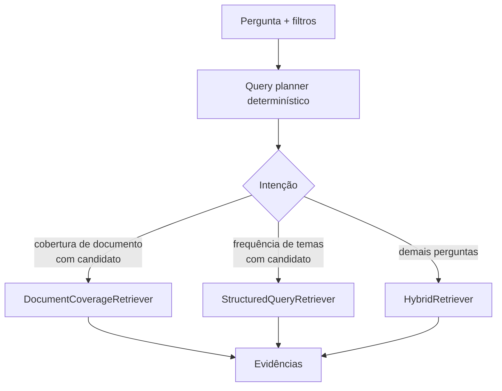

### Recuperação estruturada

- **Cobertura de documento:** ordena chunks do tipo selecionado e amostra posições distribuídas pelo documento, evitando concentrar a resposta apenas no início.
- **Frequência de temas:** agrega `PropositionTopic` com SQL `COUNT`, preservando a semântica exata de uma contagem.

### Busca lexical

A implementação atual carrega do IRIS os chunks compatíveis com candidato e tipo de fonte, normaliza caixa e acentos em Python e pontua:

```text
lexical_score = 10 × ocorrências da frase completa + ocorrências dos termos
```

Os 20 melhores resultados entram na fusão. **Não há índice IRIS de full-text implementado atualmente**; a busca lexical é calculada na aplicação.

### Busca vetorial

A pergunta recebe embedding com o mesmo modelo e dimensão dos chunks. O IRIS calcula similaridade por:

```sql
VECTOR_COSINE(Embedding, TO_VECTOR(?, DOUBLE))
```

Os 20 melhores resultados entram na fusão. **Não há índice HNSW implementado atualmente**; a consulta usa a função vetorial sobre os registros filtrados.

### Reciprocal Rank Fusion

Lexical e vetorial possuem escalas diferentes. A implementação combina posições, não scores crus:

```text
RRF(d) = Σ 1 / (60 + rank(d))
```

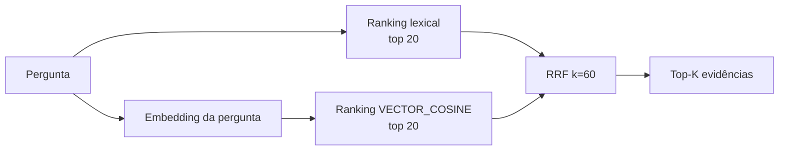

RRF oferece uma fusão estável sem fingir que frequência textual e cosseno estão na mesma escala. Aliases de tipo de fonte são normalizados antes dos filtros.

## Contexto, prompt e geração

O endpoint `/search` termina no retrieval e retorna resultados. O endpoint `/ask` continua até a geração RAG.

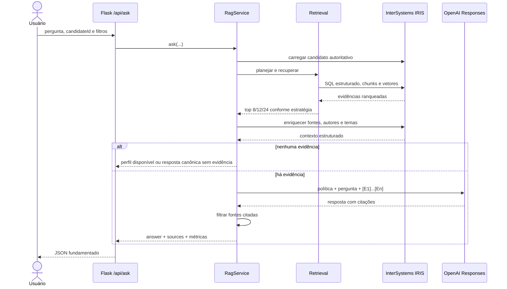

### Seleção e diversidade

- consulta normal: top 8;
- cobertura de documento para candidato selecionado: top 12;
- descoberta global: recupera até 24 e reduz a 12, com no máximo três evidências por candidato.

Quando `candidateId` foi informado, evidências de outro candidato são descartadas. O contexto combina o texto do chunk com dados estruturados da fonte, candidato, autores, temas, URL oficial e metadados de coleta.

### Política do prompt

Cada evidência recebe um identificador `[E1]`, `[E2]` etc. O prompt exige:

- resposta neutra em português brasileiro;
- uso exclusivo das evidências fornecidas;
- citações no formato `[E#]`;
- distinção explícita entre ausência de contexto e fato negativo;
- nenhuma recomendação de voto ou inferência ideológica;
- desconsideração de instruções eventualmente contidas nos documentos recuperados.

O texto externo é tratado como evidência, não como instrução, reduzindo risco de *prompt injection* no corpus.

### Chamada ao modelo e fallback

A geração usa OpenAI Responses API com `store=False`, modelo padrão `gpt-5-mini` e até 4.000 tokens de saída. Se a resposta vier incompleta ou vazia, há uma repetição com limite ampliado, no máximo 8.000 tokens. Persistindo o problema, a aplicação retorna um resumo determinístico das evidências — não inventa conteúdo.

Se não houver evidência, o LLM não é chamado. A resposta informa insuficiência de dados ou devolve apenas o perfil autoritativo disponível do candidato.

As fontes devolvidas são, preferencialmente, apenas as realmente citadas na resposta. Se o modelo não produzir citações reconhecíveis, todas as evidências usadas são mantidas para não perder rastreabilidade.

## Transações, auditoria e estados de execução

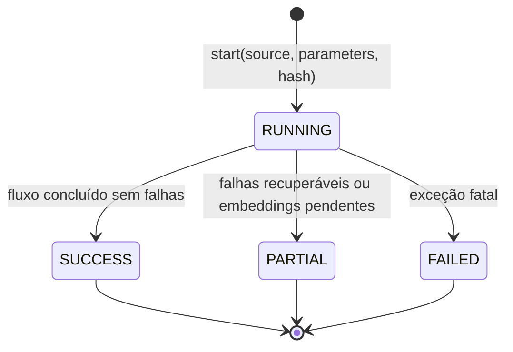

`IngestionRun` armazena início/fim, fonte, status, SHA-256 quando aplicável, parâmetros JSON, erro e contadores de lidos, criados, atualizados, ignorados e falhos. Os loops acumulam contadores em memória e os atualizam na mesma fronteira transacional dos dados correspondentes, reduzindo round trips sem separar auditoria e persistência.

Fronteiras principais:

- candidatos TSE: uma transação por lote de 500;
- proposta de governo: uma transação por PDF;
- matching/histórico: transações pequenas por candidato/registro;
- Câmara: uma transação por proposição, incluindo autores e temas;
- chunking: uma transação por documento-fonte;
- embeddings: uma transação por lote.

Rollback afeta somente a unidade em andamento. Isso permite reexecutar o processo com os upserts idempotentes sem apagar o trabalho já confirmado.

## Configuração operacional principal

| Variável | Padrão | Efeito |
|---|---:|---|
| `INGEST_ELECTION_YEAR` | `2026` | Ano eleitoral aceito |
| `INGEST_STATES` | `SP` | UFs aceitas, separadas por vírgula |
| `INGEST_OFFICES` | `DEPUTADO FEDERAL,GOVERNADOR` | Cargos aceitos |
| `CAMARA_LOOKBACK_YEARS` | `4` | Janela histórica móvel |
| `CAMARA_MAX_MATCHED_CANDIDATES` | `50` | Candidatos com coleta parlamentar detalhada |
| `CAMARA_MAX_PROPOSITIONS_PER_CANDIDATE` | `50` | Limite por candidato |
| `CAMARA_MAX_AUTHORS_PER_PROPOSITION` | `10` | Limite de autores |
| `CAMARA_HTTP_WORKERS` | `6` | Paralelismo entre proposições, de 1 a 16 |
| `HTTP_CONNECT_TIMEOUT_SECONDS` | `10` | Timeout de conexão |
| `HTTP_READ_TIMEOUT_SECONDS` | `60` | Timeout de leitura |
| `HTTP_MAX_RETRIES` | `4` | Número total de tentativas |
| `CHUNK_SIZE_TOKENS` | `700` | Tamanho-alvo do chunk |
| `CHUNK_OVERLAP_TOKENS` | `100` | Sobreposição |
| `EMBEDDING_MODEL` | `text-embedding-3-small` | Modelo vetorial |
| `EMBEDDING_BATCH_SIZE` | `50` | Chunks por chamada |
| `LLM_MODEL` | `gpt-5-mini` | Modelo de geração |
| `LLM_MAX_OUTPUT_TOKENS` | `4000` | Limite inicial da resposta |

A lista completa e os comandos de instalação estão no [README](README.md).

## Execução e validação

Com o ambiente já iniciado e saudável:

```bash
docker compose exec iris irispython -m app.ingestion.pipeline
```

Valide a API:

```bash
curl http://localhost:52773/api/health
curl http://localhost:52773/api/candidates
```

Valide as runs e os vetores no IRIS SQL:

```sql
SELECT ID, Source, Status, RecordsRead, RecordsCreated,
       RecordsUpdated, RecordsSkipped, RecordsFailed, StartedAt, FinishedAt
FROM IRISPolitical_Model.IngestionRun
ORDER BY ID DESC;

SELECT SourceType,
       COUNT(*) AS Chunks,
       SUM(CASE WHEN Embedding IS NULL THEN 1 ELSE 0 END) AS Pending
FROM IRISPolitical_Model.PoliticalChunk
GROUP BY SourceType;
```

O critério mínimo para indexação vetorial completa é `Pending = 0` em todos os tipos presentes. Uma run `PARTIAL` ou `FAILED` precisa ser explicada pelo `ErrorMessage` e pelos logs antes de se considerar o ambiente válido.

### Snapshot de uma execução validada

Em uma execução limpa realizada durante a validação do projeto, o IRIS persistiu:

| Entidade | Registros |
|---|---:|
| `Candidate` | 1.139 |
| `PoliticalHistory` | 399 |
| `Proposition` | 2.753 |
| `PropositionAuthor` | 7.351 |
| `PropositionTopic` | 1.866 |
| `ProposalDocument` | 20 |
| `PoliticalChunk` | 4.425 |

Todos os 4.425 chunks estavam com `Embedding IS NOT NULL`, e uma consulta `VECTOR_COSINE` foi executada com sucesso. Esses números são um snapshot, não um contrato: variam com filtros, limites, data e conteúdo das APIs públicas.

## Limitações atuais e melhorias futuras

| Item | Estado real |
|---|---|
| Foreign Tables | **Não implementado atualmente.** As fontes são consumidas por HTTPS e persistidas pelas classes da aplicação. |
| Índice HNSW | **Não implementado atualmente.** Existe coluna `%Vector` e busca por `VECTOR_COSINE`, sem índice ANN. |
| Full-text index no IRIS | **Não implementado atualmente.** O ranking lexical ocorre em Python. |
| OCR | **Não implementado atualmente.** A extração depende da camada textual do PDF. |
| Streaming CSV ponta a ponta | **Não implementado atualmente.** O download é streaming, mas o parser materializa registros. |
| Checkpoint incremental por fonte | **Não implementado atualmente.** Upserts e hashes tornam a reexecução idempotente, mas as fontes são relidas/reconstruídas. |
| Scheduler/produção | **Não implementado atualmente.** A ingestão é acionada por comando. |
| IRIS interoperability, Business Rules e IntegratedML | **Não implementados atualmente.** |
| Avaliação automatizada de retrieval | **Melhoria futura.** Criar conjunto de perguntas, métricas de recall/nDCG e regressão de citações. |
| Otimização de índices | **Melhoria futura.** Medir o corpus e avaliar HNSW/full-text sem mudar a semântica do retrieval. |

## Recursos do IRIS demonstrados

O pipeline evidencia, com implementação verificável:

- oito classes `%Persistent` com relacionamentos, índices e unicidade;
- SQL relacional e Object API no Embedded Python;
- `%Stream.GlobalCharacter` para documentos e auditoria bruta;
- `%Vector` de dimensão fixa e `VECTOR_COSINE`;
- transações explícitas e uma trilha de ingestão auditável;
- armazenamento multimodelo no mesmo banco usado pela API e pelo RAG;
- Flask servido pelo WSGI nativo do IRIS em `/api`.

Esse conjunto sustenta os critérios de RAG, Hybrid Search, APIs públicas, estratégia explícita de chunking/embedding e uso multimodelo previstos no [Concurso de Programação InterSystems 2026](https://pt.community.intersystems.com/post/concurso-de-programa%C3%A7%C3%A3o-da-comunidade-de-desenvolvedores-da-intersystems-pt-2026), sem reivindicar recursos ainda não implementados.
