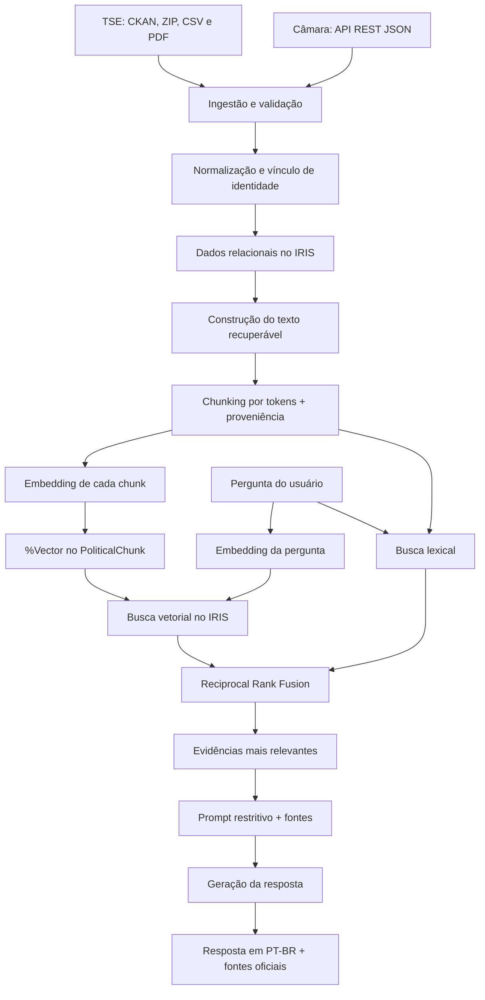
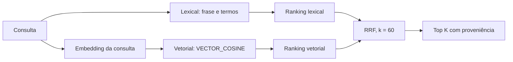

# IRIS Political Insight

## 1. Missão

Consolidar dados políticos oficiais do TSE e da Câmara dos Deputados. Persistir os dados no InterSystems IRIS. Executar busca lexical, busca vetorial e RAG com fontes rastreáveis.

Use este documento como ordem de execução para desenvolvimento, teste e diagnóstico.

## 2. Situação operacional

Arquitetura oficial:

```text
Navegador
    |
    +--> Streamlit :8501
            |
            +--> IRIS Web Gateway :52773/api
                    |
                    +--> %SYS.Python.WSGI
                            |
                            +--> Flask
                                    |
                                    +--> Embedded Python
                                            |
                                            +--> IRISAPP
```

Serviços ativos:

| Serviço | Função | Acesso local |
|---|---|---|
| `iris` | Banco, Web Gateway, WSGI e API Flask | `http://localhost:52773` |
| `ui` | Interface Streamlit | `http://localhost:8501` |

Não existe serviço `api`. Não existe Waitress. O servidor HTTP oficial da API é o IRIS.

## Como o pipeline funciona

O pipeline transforma dados públicos heterogêneos em evidências estruturadas e rastreáveis para busca híbrida e geração de respostas. O processo mantém separadas as responsabilidades de obtenção, normalização, persistência, recuperação e geração.



### 1. Ingestão

O TSE é acessado pela API CKAN. O pipeline descobre os recursos ativos, baixa os arquivos por HTTPS, calcula SHA-256, valida os ZIPs e interpreta o CSV oficial em Latin-1. As propostas de governo são extraídas dos PDFs e associadas ao candidato pelo `SQ_CANDIDATO` presente no nome oficial do arquivo, sem aproximação por nome.

A API Dados Abertos da Câmara fornece deputados, histórico parlamentar, mandatos externos, proposições, autores e temas. As coleções seguem a paginação `links[rel=next]`. O vínculo TSE–Câmara usa nome, nome de urna, UF e histórico partidário; somente correspondências classificadas como `MATCHED` disparam a ingestão parlamentar automática.

Cada execução registra origem, horários, hash e contadores em `IngestionRun`. Downloads e parsing ocorrem fora da transação; as gravações usam transações explícitas e chaves de idempotência no IRIS.

### 2. Persistência multimodelo

O mesmo backend IRIS mantém duas representações complementares:

- relacional: `Candidate`, `PoliticalHistory`, `Proposition`, `PropositionAuthor`, `PropositionTopic`, `ProposalDocument` e `IngestionRun` preservam campos, vínculos e identificadores oficiais;
- vetorial: `PoliticalChunk` reúne o texto recuperável, a proveniência, os metadados, o hash e o embedding em `%Vector(DATATYPE = "DOUBLE", LEN = 1536)`.

Essa separação permite usar SQL e relacionamentos para filtros determinísticos, enquanto a representação vetorial atende consultas por similaridade semântica.

### 3. Estratégia de chunking

O chunking é feito com `tiktoken` e parâmetros configuráveis, atualmente com janelas de 700 tokens e sobreposição de 100 tokens. O avanço efetivo é de 600 tokens. A mesma codificação é reutilizada para contar tokens e dividir o conteúdo; se o modelo não possuir uma codificação conhecida pelo `tiktoken`, o código usa `cl100k_base` como fallback.

A escolha busca equilibrar três necessidades:

- contexto suficiente para manter uma proposição, um registro histórico ou uma passagem de proposta de governo compreensível;
- granularidade suficiente para que a busca recupere o trecho relevante, sem enviar documentos inteiros ao modelo;
- continuidade entre janelas, pois a sobreposição reduz a perda de informações situadas na fronteira entre dois chunks.

Antes da divisão, o texto tem quebras de linha e espaços normalizados. Proposições e históricos curtos formam naturalmente um único chunk; conteúdos extensos, sobretudo propostas de governo, produzem múltiplas janelas. Marcadores de página extraídos do PDF permitem registrar `pageStart` e `pageEnd` quando presentes.

Cada chunk conserva:

```text
Candidate
SourceType
SourceId
ChunkIndex
Title
Content
SourceUrl
MetadataJson
ContentHash
TokenCount
```

O `ContentHash` é um SHA-256 do texto normalizado. Ele sustenta idempotência, identifica alterações e evita duplicação do mesmo conteúdo. A estratégia atual é deliberadamente simples e reproduzível: usa janelas fixas por tokens, não segmentação semântica por títulos ou parágrafos. Para documentos com estrutura complexa, uma evolução futura deve comparar essa abordagem com chunking hierárquico por seção usando métricas de retrieval.

### 4. Escolha do embedding

O padrão é `text-embedding-3-small`, chamado pelo endpoint de embeddings da OpenAI. A [documentação oficial do modelo](https://developers.openai.com/api/docs/models/text-embedding-3-small) o caracteriza como um modelo pequeno de embeddings aplicável a busca e medição de relação entre textos.

No projeto, a escolha atende ao MVP porque:

- documentos e perguntas usam exatamente o mesmo modelo;
- a chamada solicita explicitamente 1.536 dimensões;
- a dimensão coincide com `PoliticalChunk.Embedding` no IRIS;
- o vetor é validado antes da persistência;
- o perfil menor é adequado ao ciclo de ingestão e consulta da demonstração.

O nome do modelo é configurável, mas a implementação atual exige 1.536 dimensões. Trocar o modelo requer confirmar suporte ao parâmetro de dimensão, compatibilidade com o tokenizer e recompilar a propriedade `%Vector` caso a dimensão seja alterada.

### 5. Indexação e recuperação

Após a criação dos chunks, os embeddings pendentes são gerados e persistidos em `PoliticalChunk.Embedding`. O MVP não cria índice vetorial HNSW: a busca semântica usa `VECTOR_COSINE(Embedding, TO_VECTOR(...))` no IRIS e ordena pela similaridade. Essa opção reduz a configuração inicial e atende cargas pequenas de demonstração; volumes maiores devem adicionar e medir um índice vetorial compatível com a versão do IRIS.

A recuperação executa dois rankings independentes:

- lexical: normaliza acentos e caixa, favorece a frase exata e conta ocorrências dos termos em `Title` e `Content`;
- vetorial: gera o embedding da pergunta e calcula similaridade cosseno no IRIS.

A busca lexical atual carrega do IRIS os chunks compatíveis com os filtros e calcula o ranking em Python. Isso mantém a regra transparente, mas deve ser substituído por um índice textual do IRIS se o volume crescer.

Cada mecanismo retorna até 20 resultados. O RRF combina as posições com `k = 60`, sem tentar comparar diretamente escalas incompatíveis de pontuação, e entrega por padrão as 8 evidências mais bem posicionadas.



### 6. Prompt e geração da resposta

O serviço RAG recebe as evidências recuperadas e constrói blocos identificados como `[E1]`, `[E2]` e assim por diante. Cada bloco inclui título, tipo, URL oficial e trecho. As instruções do modelo exigem uso exclusivo das evidências, proíbem recomendação de voto e classificação ideológica e determinam que insuficiência de contexto seja declarada explicitamente.

Se a busca não retornar evidências, o LLM nem é chamado. A API devolve a mensagem de insuficiência e uma lista vazia de fontes. Quando há contexto, `/ask` retorna a resposta e todas as fontes utilizadas no prompt.

## Aderência ao concurso

A implementação foi confrontada com as [regras publicadas do concurso](https://community.intersystems.com/post/1st-portuguese-programming-contest-2026). A tabela diferencia o que existe no repositório do que ainda depende de preparação para a submissão.

| Critério | Evidência no projeto | Situação |
|---|---|---|
| Aplicação RAG com backend InterSystems | Classes `%Persistent`, `%Vector`, SQL, WSGI e Embedded Python executam no IRIS | Implementado |
| Dados multimodelo | Modelo relacional e representação vetorial são acessados no mesmo backend | Implementado |
| Busca híbrida | Ranking lexical e similaridade vetorial são combinados por RRF | Implementado |
| Acesso a API pública | CKAN/Dados Abertos do TSE e API Dados Abertos da Câmara | Implementado |
| Estratégia de chunking e escolha de embedding | Análise, parâmetros, limitações e compatibilidade vetorial documentados acima | Documentado e implementado |
| Clareza do pipeline RAG | Ingestão, chunking, persistência vetorial, retrieval, prompt e geração estão descritos e mapeados para o código | Documentado e implementado |
| WSGI para a aplicação web | `IRIS Web Gateway -> %SYS.Python.WSGI -> Flask` configurado automaticamente por IPM | Implementado |
| Foreign Table | Não há definição ou acesso a Foreign Table no repositório | Não implementado |

Na página oficial, WSGI aparece no bloco do tópico PyProd, enquanto este projeto concorre no tópico RAG. A arquitetura WSGI está implementada e documentada, mas sua consideração na avaliação do tópico RAG não deve ser presumida.

### Pendências para a submissão

O código cobre o núcleo técnico, mas a inscrição completa também depende de materiais externos ao runtime:

- publicar a aplicação no Open Exchange;
- publicar um artigo na Developer Community em português, descrevendo ideia, processo, instruções, metodologia, prompts, ferramentas de IA, ajustes e alucinações observadas;
- incluir no artigo as tags e o link da aplicação exigidos pela organização;
- preparar a aplicação, descrição, instruções, capturas e README em inglês para o pacote enviado ao Open Exchange.

Este README permanece em PT-BR conforme a documentação de desenvolvimento do repositório. Antes do envio ao Open Exchange, a versão inglesa deve ser preparada e validada sem eliminar este passo a passo.

## 3. Pré-requisitos

Confirme antes de avançar:

- Docker Desktop ativo;
- Docker Compose disponível;
- acesso à imagem `intersystems/iris-community:latest-cd`;
- portas `1972`, `52773` e `8501` livres;
- Python 3.12 para desenvolvimento local;
- chave OpenAI para ingestão com embeddings, `/search` e `/ask`.

Comandos de inspeção:

```powershell
docker version
docker compose version
python --version
```

Critério: nenhum comando deve falhar.

## 4. Subir o projeto com Docker

### Passo 1 — Preparar o ambiente

Execute na raiz do projeto:

```powershell
Copy-Item .env.example .env
notepad .env
```

Preencha, no mínimo:

```dotenv
LLM_API_KEY=sua-chave
```

A chave é dispensável para `/health` e consultas básicas. Ela é obrigatória para embeddings e respostas RAG.

### Referência completa das variáveis de ambiente

`app.config.Settings` carrega o arquivo `.env` automaticamente quando a aplicação é
executada diretamente no host. Os nomes não diferenciam maiúsculas de minúsculas, mas
o projeto usa maiúsculas por convenção. Valores vazios são ignorados; por isso,
`LLM_API_KEY=` resulta em chave ausente.

No Docker Compose, o `.env` também é usado para interpolar o
`docker-compose.yml`. Somente variáveis declaradas em `environment` são encaminhadas
ao respectivo container. Uma variável existente no `.env`, mas não encaminhada pelo
Compose, continua usando o padrão de `Settings` dentro do container.

#### IRIS e persistência

| Variável | Padrão | Onde é utilizada | Efeito |
|---|---:|---|---|
| `IRIS_HOST` | `localhost` | `app/database/connection.py` | Host da conexão TCP usada no desenvolvimento local. No Embedded Python dentro do IRIS, não é utilizada. |
| `IRIS_PORT` | `1972` | `app/database/connection.py` | Porta do SuperServer para o driver DB-API local. Não controla o mapeamento de portas do Docker. |
| `IRIS_NAMESPACE` | `IRISAPP` | `app/database/connection.py` | Namespace usado pela conexão TCP. No runtime embarcado, vale o namespace do processo IRIS. |
| `IRIS_USERNAME` | `_SYSTEM` | `app/database/connection.py` | Usuário do driver DB-API local. Não é usado pela conexão embarcada. |
| `IRIS_PASSWORD` | `SYS` | `app/database/connection.py` | Senha do driver DB-API local. Deve ser substituída fora do ambiente de desenvolvimento. |
| `IRIS_SQL_SCHEMA` | `IRISPolitical_Model` | repositórios, busca, RAG e ingestão | Schema que qualifica todas as tabelas SQL. Aceita somente identificador alfanumérico iniciado por letra, com `_` opcional. |

No `docker-compose.yml`, somente `IRIS_SQL_SCHEMA` é encaminhada ao container `iris`,
e atualmente está fixada em `IRISPolitical_Model`. As demais variáveis `IRIS_*` são
relevantes principalmente ao executar Flask, testes ou scripts Python no host.

#### Fonte TSE

| Variável | Padrão | Onde é utilizada | Efeito |
|---|---:|---|---|
| `TSE_CKAN_BASE_URL` | `https://dadosabertos.tse.jus.br/api/3/action` | `app/ingestion/tse/client.py` | Endpoint CKAN usado para descobrir o dataset e seus recursos. O código exige HTTPS e o host oficial do TSE. |
| `TSE_DATASET_ID` | `candidatos-2026` | cliente TSE e auditoria da ingestão | Identificador consultado em `package_show`; também é gravado nos parâmetros do `IngestionRun`. |
| `TSE_PORTAL_URL` | portal do dataset de 2026 | somente `app/config/settings.py` | Variável reservada para links de documentação/interface. Não é consumida pela ingestão atual. |

No Compose, somente `TSE_DATASET_ID` é encaminhada ao container `iris`. Alterações em
`TSE_CKAN_BASE_URL` feitas apenas no `.env` afetam a execução local, mas não o container
sem uma entrada correspondente em `docker-compose.yml`.

#### API da Câmara e controle de volume

| Variável | Padrão | Onde é utilizada | Efeito |
|---|---:|---|---|
| `CAMARA_BASE_URL` | `https://dadosabertos.camara.leg.br/api/v2` | `app/ingestion/camara/client.py` e pipeline | Base dos endpoints de deputados, histórico, mandatos, proposições, autores e temas. O host oficial e HTTPS são obrigatórios. |
| `CAMARA_MATCH_START_DATE` | `2020-01-01` no `.env.example` | somente `app/config/settings.py` | Configuração legada/reservada. No código atual ela não altera o matching nem a ingestão. |
| `CAMARA_PAGE_SIZE` | `100` | `app/ingestion/camara/client.py` | Quantidade solicitada por página nas coleções da Câmara; aceita de 1 a 100. |
| `CAMARA_LOOKBACK_YEARS` | `4` | `app/ingestion/camara/client.py` e pipeline | Calcula uma janela móvel a partir da data da execução. Filtra deputados considerados, histórico, mandatos e proposições. |
| `CAMARA_MAX_MATCHED_CANDIDATES` | `10` | `app/ingestion/pipeline.py` | Limita quantos candidatos com correspondência recebem ingestão parlamentar detalhada em uma execução. O matching ainda pode ser salvo para outros candidatos. |
| `CAMARA_MAX_PROPOSITIONS_PER_CANDIDATE` | `50` | `app/ingestion/camara/client.py` | Limita as proposições mais recentes por parlamentar. A API é consultada em janelas de até três meses até atingir esse teto ou os quatro anos. |
| `CAMARA_MAX_AUTHORS_PER_PROPOSITION` | `10` | `app/ingestion/camara/client.py` | Limita autores/apoiadores persistidos por proposição, priorizando registros marcados como proponentes. |

O Compose encaminha as quatro variáveis de janela e limites. Atualmente não encaminha
`CAMARA_BASE_URL`, `CAMARA_MATCH_START_DATE` nem `CAMARA_PAGE_SIZE`; dentro do container,
essas três usam os padrões definidos em `Settings`.

#### Recorte da ingestão e acesso HTTP

| Variável | Padrão | Onde é utilizada | Efeito |
|---|---:|---|---|
| `INGEST_ELECTION_YEAR` | `2026` | `app/ingestion/pipeline.py` | Mantém somente candidaturas do ano configurado. |
| `INGEST_STATES` | `SP` | pipeline TSE | Lista separada por vírgulas de UFs aceitas. Os valores são normalizados para maiúsculas. |
| `INGEST_OFFICES` | `DEPUTADO FEDERAL,GOVERNADOR` | pipeline TSE | Lista separada por vírgulas dos cargos aceitos. Também é normalizada para maiúsculas. |
| `HTTP_CONNECT_TIMEOUT_SECONDS` | `10` | `app/ingestion/http.py`, via pipeline | Tempo máximo para estabelecer conexão com TSE ou Câmara. |
| `HTTP_READ_TIMEOUT_SECONDS` | `60` | `app/ingestion/http.py`, via pipeline | Tempo máximo de espera pela resposta após a conexão. |
| `HTTP_MAX_RETRIES` | `4` | `app/ingestion/http.py`, via pipeline | Número de tentativas para falhas de conexão, timeout, `429` e erros HTTP transitórios. Aceita de 1 a 10. |

O Compose encaminha `INGEST_ELECTION_YEAR`, `INGEST_STATES` e `INGEST_OFFICES`.
Os três controles HTTP usam os padrões de `Settings` no container e podem ser alterados
diretamente quando o pipeline é executado no host.

#### Chunking, embeddings e geração de resposta

| Variável | Padrão | Onde é utilizada | Efeito |
|---|---:|---|---|
| `CHUNK_SIZE_TOKENS` | `700` | `app/ingestion/pipeline.py` e `TokenChunker` | Tamanho-alvo de cada chunk em tokens. |
| `CHUNK_OVERLAP_TOKENS` | `100` | `app/ingestion/pipeline.py` e `TokenChunker` | Sobreposição entre chunks consecutivos. Deve ser menor que `CHUNK_SIZE_TOKENS`. |
| `EMBEDDING_PROVIDER` | `openai` | somente `app/config/settings.py` | Campo reservado. A implementação atual instancia diretamente `OpenAIEmbedder`. |
| `EMBEDDING_MODEL` | `text-embedding-3-small` | ingestão, busca vetorial e fábrica de serviços | Modelo usado para tokenização e geração de embeddings. |
| `EMBEDDING_DIMENSION` | `1536` | embedder e busca vetorial | Deve permanecer em `1536`, igual ao `LEN` de `PoliticalChunk.Embedding` no IRIS. |
| `LLM_PROVIDER` | `openai` | somente `app/config/settings.py` | Campo reservado. A implementação atual instancia diretamente o cliente OpenAI. |
| `LLM_API_KEY` | vazio | ingestão, `/search` e `/ask` | Quando ausente, os chunks são criados sem embeddings e a etapa registra `embedding stage skipped`. Busca vetorial e RAG exigem a chave. |
| `LLM_MODEL` | `gpt-5-mini` | `app/api/services.py` | Modelo usado pela geração final de resposta no endpoint `/ask`. |

No Compose, `EMBEDDING_MODEL`, `LLM_API_KEY` e `LLM_MODEL` são encaminhadas ao
container `iris`. As demais usam o padrão de `Settings` dentro do container.

#### API Flask e interface Streamlit

| Variável | Padrão | Onde é utilizada | Efeito |
|---|---:|---|---|
| `API_BASE_URL` | `http://localhost:52773/api` | `app/ui/streamlit_app.py` | URL que a interface usa para chamar a API. No Compose, o container `ui` recebe fixamente `http://iris:52773/api`. |
| `API_HOST` | `0.0.0.0` | `app/api/__main__.py` | Endereço de bind somente ao executar `python -m app.api`. Não controla o WSGI nativo do IRIS. |
| `API_PORT` | `8000` | `app/api/__main__.py` | Porta do Flask local. Não altera `/api` na porta `52773` do IRIS. |

#### Variáveis internas de imagem e testes

Estas variáveis não fazem parte da configuração funcional do `.env.example`:

| Variável | Definida em | Finalidade |
|---|---|---|
| `IRISUSERNAME`, `IRISPASSWORD`, `IRISNAMESPACE` | `Dockerfile`, estágio `iris` | Convenções do runtime/ferramentas do IRIS durante build e execução embarcada. Não são os mesmos nomes `IRIS_USERNAME`, `IRIS_PASSWORD` e `IRIS_NAMESPACE` usados por `Settings`. |
| `PATH` | `Dockerfile`, estágio `iris` | Disponibiliza `iris`, `irispython` e scripts do usuário no shell do container. |
| `PYTHONDONTWRITEBYTECODE` | `Dockerfile`, estágio `ui` | Evita arquivos `.pyc` na imagem da interface. |
| `PYTHONUNBUFFERED` | `Dockerfile`, estágio `ui` | Envia logs Python imediatamente para `docker compose logs`. |
| `PIP_DISABLE_PIP_VERSION_CHECK` | `Dockerfile`, estágio `ui` | Desativa a verificação de nova versão do `pip` durante o build. |
| `RUN_IRIS_TESTS` | `tests/test_iris_integration.py` | Quando igual a `1`, habilita testes de integração que acessam um IRIS real. |
| `RUN_SMOKE_TESTS` | `tests/test_smoke.py` | Quando igual a `1`, habilita smoke tests que exigem o Docker Compose ativo. |

`IRIS_IMAGE` é um argumento de build, não uma variável carregada por `Settings`. Ele
permite substituir a imagem-base:

```powershell
docker compose build --build-arg IRIS_IMAGE=intersystems/iris-community:latest-cd
```

### Passo 2 — Construir as imagens

Para o primeiro build ou para validar uma alteração estrutural:

```powershell
docker compose build --no-cache
```

Para o ciclo normal:

```powershell
docker compose build
```

Critério: o build deve terminar sem `ERROR`, `FAILURE`, `<SYNTAX>` ou dependências quebradas.

### Passo 3 — Subir os containers

```powershell
docker compose up -d
docker compose ps
```

Resultado esperado:

```text
iris    Up ... (healthy)
ui      Up ...
```

Não prossiga se o IRIS não estiver `healthy`.

### Passo 4 — Inspecionar os logs

```powershell
docker compose logs --tail 100 iris
docker compose logs --tail 100 ui
```

Para acompanhar continuamente:

```powershell
docker compose logs -f iris ui
```

Interrompa o acompanhamento com `Ctrl+C`. Os containers continuarão ativos.

## 5. Testar a aplicação

### Teste 1 — API WSGI

```powershell
Invoke-RestMethod http://localhost:52773/api/health
```

Resultado esperado:

```text
status
------
ok
```

Alternativa com curl real no Windows:

```powershell
curl.exe -i http://localhost:52773/api/health
```

Critério: HTTP `200` e corpo `{"status":"ok"}`.

### Teste 2 — Consulta real ao IRISAPP

```powershell
Invoke-RestMethod http://localhost:52773/api/candidates
```

Resultado mínimo esperado:

```json
{"items":[]}
```

Uma lista vazia é válida antes da ingestão. HTTP `500` não é válido.

### Teste 3 — Interface

Abra:

```text
http://localhost:8501
```

Teste técnico:

```powershell
Invoke-WebRequest -UseBasicParsing http://localhost:8501/_stcore/health
```

Critério: HTTP `200` e corpo `ok`.

### Teste 4 — Ambiente Embedded Python

```powershell
docker compose exec -T iris irispython -c "from importlib.metadata import version; import wsgi_app; print(version('flask')); print(callable(wsgi_app.app))"
docker compose exec -T iris python3 -m pip check
```

Critério: o callable deve ser `True` e o `pip check` deve informar `No broken requirements found`.

## 6. Carregar dados

Execute a ingestão dentro do IRIS. Este é o caminho oficial em container:

```powershell
docker compose exec iris irispython -m app.ingestion.pipeline
```

Aguarde a conclusão. Não interrompa durante gravações no banco. Por padrão, a etapa
da Câmara consulta somente os últimos quatro anos e mantém o volume adequado à edição
Community: até 10 parlamentares correspondentes, 50 proposições por parlamentar e 10
autores/apoiadores por proposição. Os limites podem ser ajustados por
`CAMARA_LOOKBACK_YEARS`, `CAMARA_MAX_MATCHED_CANDIDATES`,
`CAMARA_MAX_PROPOSITIONS_PER_CANDIDATE` e `CAMARA_MAX_AUTHORS_PER_PROPOSITION`.

Depois, confirme:

```powershell
Invoke-RestMethod http://localhost:52773/api/candidates
```

Se a ingestão falhar, capture os logs antes de reiniciar:

```powershell
docker compose logs --tail 200 iris
```

## 7. Rotas HTTP

Base oficial em Docker:

```text
http://localhost:52773/api
```

| Método | Rota | Finalidade |
|---|---|---|
| `GET` | `/health` | Validar WSGI, Flask e acesso SQL ao IRIS |
| `GET` | `/candidates` | Listar candidatos |
| `GET` | `/candidates/{id}` | Consultar um candidato |
| `GET` | `/candidates/{id}/propositions` | Listar proposições do candidato |
| `POST` | `/search` | Executar busca híbrida |
| `POST` | `/ask` | Responder com RAG e fontes |

### Listar e filtrar candidatos

Filtros opcionais: `name`, `party`, `state` e `office`.

```powershell
curl.exe "http://localhost:52773/api/candidates?state=SP&office=DEPUTADO%20FEDERAL"
```

### Consultar candidato

```powershell
curl.exe http://localhost:52773/api/candidates/123
```

### Consultar proposições

```powershell
curl.exe http://localhost:52773/api/candidates/123/propositions
```

### Executar busca híbrida

```powershell
curl.exe -X POST http://localhost:52773/api/search `
  -H "Content-Type: application/json" `
  -d '{"query":"educação pública","candidateId":123,"sourceType":"proposition","topK":8}'
```

Campos:

- `query`: obrigatório; máximo de 2.000 caracteres;
- `candidateId`: opcional; inteiro positivo;
- `sourceType`: opcional;
- `topK`: opcional; valor entre 1 e 50; padrão 8.

### Perguntar ao RAG

```powershell
curl.exe -X POST http://localhost:52773/api/ask `
  -H "Content-Type: application/json" `
  -d '{"question":"Quais propostas tratam de educação?","candidateId":123}'
```

Campos:

- `question`: obrigatório; máximo de 4.000 caracteres;
- `candidateId`: opcional; inteiro positivo.

Respostas de erro previstas:

| HTTP | Significado |
|---|---|
| `400` | Corpo, filtro ou valor inválido |
| `404` | Candidato não encontrado |
| `500` | Falha não tratada; inspecione `WSGI.log` |

## 8. Desenvolvimento Python local

Use o IRIS no Docker. Execute o código Python no Windows. Esse arranjo permite breakpoints, reload e inspeção do processo.

### Passo 1 — Subir somente o IRIS

```powershell
docker compose up -d iris
docker compose ps
```

Critério: `iris` deve estar `healthy`.

### Passo 2 — Criar o ambiente virtual

```powershell
python -m venv .venv
.\.venv\Scripts\Activate.ps1
python -m pip install --upgrade pip
python -m pip install -r requirements-dev.txt
```

O arquivo `.env` é carregado automaticamente. Confirme estes valores:

```dotenv
IRIS_HOST=localhost
IRIS_PORT=1972
IRIS_NAMESPACE=IRISAPP
IRIS_USERNAME=_SYSTEM
IRIS_PASSWORD=SYS
```

### Missão A — Executar somente a UI local

Mantenha a API no WSGI nativo do IRIS:

```powershell
$env:API_BASE_URL="http://localhost:52773/api"
python -m streamlit run app/ui/streamlit_app.py --server.port 8501
```

Use este modo para depurar a interface sem alterar o runtime oficial da API.

### Missão B — Executar Flask local com reload

Pare a UI do Compose para liberar a porta 8501, se necessário:

```powershell
docker compose stop ui
```

Suba o Flask local:

```powershell
python -m flask --app app.api.app:create_app --debug run --host 0.0.0.0 --port 8000
```

Base local neste modo:

```text
http://localhost:8000
```

As rotas ficam sem o prefixo `/api` porque o prefixo pertence ao mount point do IRIS:

```powershell
Invoke-RestMethod http://localhost:8000/health
Invoke-RestMethod http://localhost:8000/candidates
```

Não use o servidor Flask de desenvolvimento em produção.

### Missão C — Executar UI e Flask locais

Terminal 1:

```powershell
python -m flask --app app.api.app:create_app --debug run --host 0.0.0.0 --port 8000
```

Terminal 2:

```powershell
.\.venv\Scripts\Activate.ps1
$env:API_BASE_URL="http://localhost:8000"
python -m streamlit run app/ui/streamlit_app.py --server.port 8501
```

Fluxo resultante:

```text
Streamlit local :8501 -> Flask local :8000 -> TCP 1972 -> IRIS no Docker
```

## 9. Debug com breakpoint remoto

### Passo 1 — Iniciar o processo e aguardar o depurador

```powershell
python -m debugpy --listen 5678 --wait-for-client `
  -m flask --app app.api.app:create_app run `
  --no-reload --host 0.0.0.0 --port 8000
```

O processo ficará parado até o IDE conectar.

### Passo 2 — Conectar o IDE

Configure `Python: Attach` com:

```text
host: localhost
port: 5678
```

### Passo 3 — Posicionar o breakpoint

Posicione o breakpoint em `app/api/app.py`, `app/repositories/` ou `app/database/connection.py`. Faça uma requisição para `http://localhost:8000`.

Critério: o depurador deve interromper na linha marcada.

## 10. Testes automatizados

Ative o ambiente virtual:

```powershell
.\.venv\Scripts\Activate.ps1
```

### Testes unitários

```powershell
pytest -m unit
```

Não exigem IRIS nem rede externa.

### Testes de integração com IRIS

Suba o IRIS e execute:

```powershell
docker compose up -d iris
$env:RUN_IRIS_TESTS="1"
pytest -m integration
Remove-Item Env:RUN_IRIS_TESTS
```

Esses testes gravam dados temporários no namespace `IRISAPP` e executam operações de repositório e busca.

### Smoke tests dos serviços

Suba os dois serviços e execute:

```powershell
docker compose up -d
$env:RUN_SMOKE_TESTS="1"
pytest -m smoke
Remove-Item Env:RUN_SMOKE_TESTS
```

### Qualidade estática

```powershell
ruff check app tests wsgi_app.py
mypy app wsgi_app.py
```

Ordem de aceite:

1. Execute testes unitários.
2. Execute análise estática.
3. Execute testes de integração.
4. Execute smoke tests.
5. Não entregue código com falha conhecida.

## 11. Parar e limpar

Parar sem remover containers:

```powershell
docker compose stop
```

Remover containers e preservar dados:

```powershell
docker compose down
```

Remover containers e apagar o volume IRIS:

```powershell
docker compose down -v
```

> ATENÇÃO: `docker compose down -v` apaga os dados persistidos pelo projeto. Use somente quando a perda for intencional.

## 12. Diagnóstico

### API retorna HTTP 500

Execute:

```powershell
docker compose exec -T iris sh -lc "tail -100 /usr/irissys/mgr/WSGI.log"
docker compose logs --tail 200 iris
```

### API retorna HTTP 401 ou 403

Verifique a Web Application `/api`, a autenticação e os papéis associados. Para este MVP/dev, a configuração esperada é:

```text
AutheEnabled = 64
MatchRoles   = :%All
```

### Alteração Python não aparece no WSGI

Reconstrua e recrie o IRIS:

```powershell
docker compose build iris
docker compose up -d --force-recreate iris
```

O IRIS mantém módulos Python em memória. Reinicie o serviço após alterar código carregado pelo WSGI.

### Flask local não conecta ao IRIS

Confirme:

```powershell
docker compose ps iris
Test-NetConnection localhost -Port 1972
```

Revise `IRIS_HOST`, `IRIS_PORT`, `IRIS_NAMESPACE`, `IRIS_USERNAME` e `IRIS_PASSWORD` no `.env`.

### UI não acessa a API

No Docker, use:

```text
API_BASE_URL=http://iris:52773/api
```

No host, use:

```text
API_BASE_URL=http://localhost:52773/api
```

No modo Flask local, use:

```text
API_BASE_URL=http://localhost:8000
```

## 13. WSGI e segurança

Configuração instalada automaticamente pelo IPM:

```text
URL               = /api
NameSpace         = IRISAPP
DispatchClass     = %SYS.Python.WSGI
WSGIAppLocation   = /usr/irissys/lib/iris-political-insight/
WSGIAppName       = wsgi_app
WSGICallable      = app
```

As dependências da API são instaladas em `/usr/irissys/mgr/python`, diretório acessível ao Embedded Python do IRIS.

> SEGURANÇA: o acesso não autenticado recebe `%All` somente neste MVP de desenvolvimento. Antes de publicar, habilite autenticação e substitua `%All` por papéis de privilégio mínimo.

Credenciais padrão locais:

```text
usuário: _SYSTEM
senha:   SYS
```

Troque essas credenciais fora do ambiente local.

## 14. Documentação

- [Especificação do produto](docs/SPEC%20%E2%80%94%20IRIS%20Political%20Insight.md)
- [Plano de implementação](docs/IMPLEMENTATION_PLAN.md)
- [Tecnologias e bibliotecas](docs/IMPLEMENTACAO_TECNICA_TECNOLOGIAS_E_LIBS.md)
- [Ingestão TSE, Câmara e IRIS](docs/IMPLEMENTACAO_INGESTAO_TSE_CAMARA_IRIS.md)
- [Classes IRIS e mapeamento](docs/CLASSES_IRIS_E_MAPEAMENTO_INGESTAO_ATUAL.md)
- [Migração para WSGI nativo](docs/MIGRACAO_FLASK_WAITRESS_PARA_IRIS_WSGI.md)
- [WSGI no InterSystems IRIS](https://docs.intersystems.com/irislatest/csp/docbook/DocBook.UI.Page.cls?KEY=AWSGI)
- [Embedded Python](https://docs.intersystems.com/irislatest/csp/docbook/DocBook.UI.Page.cls?KEY=GEPYTHON)
- [Instalação de pacotes Python](https://docs.intersystems.com/irislatest/csp/docbook/DocBook.UI.Page.cls?KEY=GEPYTHON_loadlib)

## 15. Comandos rápidos

```powershell
# Subir
docker compose up --build -d

# Estado
docker compose ps

# Health
Invoke-RestMethod http://localhost:52773/api/health

# Logs
docker compose logs --tail 100 iris ui

# Testes unitários
pytest -m unit

# Parar preservando dados
docker compose down
```

No Linux ou macOS, troque `Copy-Item` por `cp` e ative o ambiente com:

```bash
source .venv/bin/activate
```
