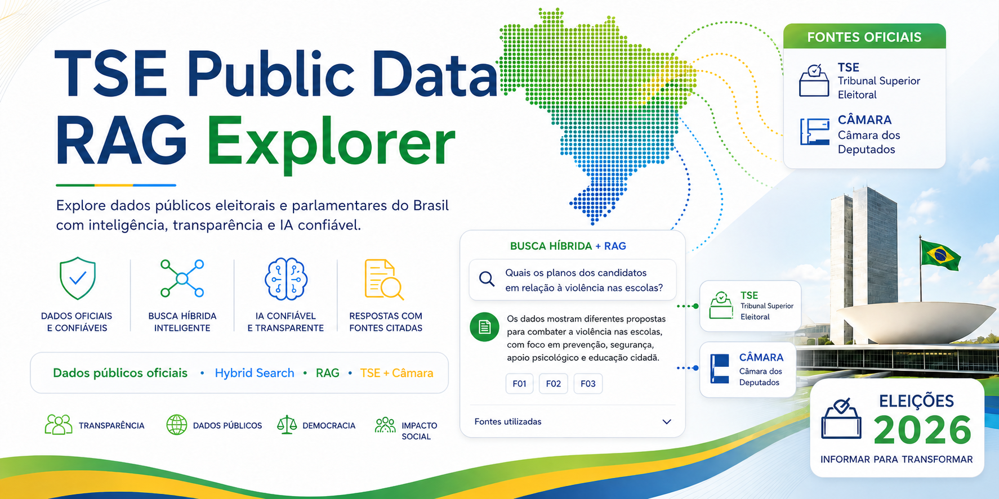

# 🗳️ TSE Public Data RAG Explorer

## 🌐 Introduction

**TSE Public Data RAG Explorer** is a platform for querying and analyzing Brazilian public electoral and parliamentary data. Built with **InterSystems IRIS**, **Hybrid Search**, and **RAG (Retrieval-Augmented Generation)**, it integrates, structures, links, indexes, retrieves, and contextualizes official evidence from the **Superior Electoral Court (TSE)** and the **Chamber of Deputies**, with traceability back to the source.



> **Brazil is campaigning for the 2026 General Elections. What if exploring public electoral data were as simple as asking a question?**

[Portuguese version](README.pt.md) · [Technical pipeline](PIPELINE.pt.md) · [Article in Portuguese](ARTICLE.pt.md)

On **October 4, 2026**, **158,745,463 voters** will be eligible to participate in Brazil's General Elections, choosing representatives for **six elective offices**: President of the Republic, state governors, the Federal Senate, the Chamber of Deputies, state legislative assemblies, and, in the Federal District, the Legislative Chamber. A **runoff election for president and governors** will be held on **October 25**. Source: [Superior Electoral Court (TSE)](https://www.tse.jus.br/comunicacao/noticias/2026/Julho/mais-de-158-milhoes-de-eleitores-estao-aptos-votar-nas-eleicoes-2026).

Brazil publishes a significant amount of data on candidacies and parliamentary activity. The challenge is to transform distributed files, APIs, identifiers, and documents into information that people can actually explore.

Public data does not automatically mean accessible information. An investigation may require knowledge of government APIs, ZIP files, CSV files, PDFs, SQL, different identifiers for the same person, and multiple official systems. The goal is to reduce this barrier without replacing the original sources.

## 💡 The solution

The project brings together two complementary dimensions:

- the **TSE** provides the electoral context: candidacies, office, party, state, and government platforms when available;
- the **Chamber of Deputies** provides parliamentary context for candidacies that can be linked safely: history, external mandates, legislative proposals, authors, and topics.

A candidacy tells us who is running. Legislative data can add context about those who have already served as federal deputies. The link between the databases is deterministic and auditable, and parliamentary data is collected only when the link is classified as <code>MATCHED</code>.

On top of this foundation, the system combines structured filters, lexical search, and vector similarity; retrieves evidence; enriches each passage with data from its source entity; and asks the language model for a synthesis limited to the retrieved context.

## 🧭 Project principles

The system does not try to answer:

> Who is the best candidate?

The goal is to answer exploratory questions using RAG:

> "What do the available official sources say about this candidate and the topic being researched?"
>
> “What is this candidate's position on protecting children and adolescents online?”
>
> “Does this candidate present proposals to combat violence in schools? What are they?”
>
> “Which candidates have proposals related to reducing the 6x1 work schedule?”
>
> “Which candidates present proposals for regulating social media and combating disinformation?”
>
> “Which candidates have proposals related to the use of artificial intelligence in the public sector?”

These questions correspond to paths available in the implementation. The answer depends on the ingested scope and the available evidence.

The application does not:

- recommend how to vote;
- rank candidates;
- assign political scores;
- predict election results;
- automatically determine ideology;
- replace the reading of original sources.

The system provides **information + context + evidence**.

## 🏗️ Architecture

The implemented flow is **collect → validate → link → persist → split → represent → retrieve → contextualize → explain**.

```text
                    Public sources

              TSE              Chamber
               │                  │
               └────────┬─────────┘
                        │
                    Ingestion
                        │
                        ▼
               InterSystems IRIS
          ┌─────────────┼─────────────┐
          │             │             │
          ▼             ▼             ▼
      Candidate     Proposition   PoliticalChunk
      Relational     Relational      VECTOR
          │             │             │
          └─────────────┼─────────────┘
                        │
                 Hybrid Search
               ┌────────┴────────┐
               │                 │
          Keyword Search    Vector Search
               │                 │
               └────────┬────────┘
                        │
                       RRF
                        │
                     Top K
                        │
                       LLM
                        │
                        ▼
                 Answer + sources
```

There is no <code>api</code> container or Waitress. IRIS serves the Flask API; the second container contains only the Streamlit UI.

## 🧩 Implementations in the IRIS ecosystem

| Capability | Effective use |
|---|---|
| Persistent classes | Eight <code>%Persistent</code> classes model candidacies, history, legislative proposals, authors, topics, documents, chunks, and runs. |
| SQL | Parameterized SQL is used for filters, aggregations, relationships, structured context, and auditing. |
| Object API | Embedded Python uses <code>_OpenId()</code>, <code>_New()</code>, and <code>_Save()</code> in specific <code>Candidate</code> and <code>IngestionRun</code> operations. |
| Streams | Extracted PDFs and history JSON are stored in <code>%Stream.GlobalCharacter</code>. |
| Vector Search | 1,536-dimensional embeddings are stored in <code>%Vector</code>; IRIS calculates <code>VECTOR_COSINE</code>. |
| Multimodel | Relationships, objects, streams, and vectors make up a single database, with no separate vector database. |
| Embedded Python | Ingestion, API, retrieval, and RAG run in the <code>IRISAPP</code> namespace. |
| Native WSGI | The Web Gateway hosts Flask through <code>%SYS.Python.WSGI</code> at <code>/api</code>. |
| Transactions/auditing | Commit, rollback, and <code>IngestionRun</code> make the process observable and repeatable. |

SQL handles what is deterministic, streams preserve documents, vectors approximate meanings, and the RAG context brings these representations together in the IRIS core.

## 🔎 RAG + Hybrid Search

Electoral data contains names, acronyms, parties, states, offices, numbers, and IDs that require exact matching. Human questions may also express the same concept using different words.

| Mechanism | Role |
|---|---|
| Lexical search | Favors exact phrases and terms after case and accent normalization. |
| Vector Search | Uses the question embedding and <code>VECTOR_COSINE</code> in IRIS. |
| Hybrid Search | Combines rankings using RRF (<code>k=60</code>) without mixing incompatible scores. |
| RAG | Provides evidence to the LLM so it can produce a cited synthesis conditioned on the sources. |

The LLM is not called when there is no valid evidence. The prompt requires neutral language, exclusive use of the <code>[E1]</code> and <code>[E2]</code> blocks, citations, and an explicit statement when context is insufficient. RAG does not eliminate hallucinations; it seeks to reduce them by conditioning generation on the retrieved material.

## 🏛️ Official sources

| Source | Content | Access |
|---|---|---|
| [TSE Open Data](https://dadosabertos.tse.jus.br/dataset/candidatos-2026) | 2026 candidacies and government platforms when available | CKAN, ZIP, Latin-1 CSV, and PDFs |
| [Chamber of Deputies Open Data](https://dadosabertos.camara.leg.br/) | Deputies, history, mandates, legislative proposals, authors, and topics | Paginated REST v2 JSON |

Each chunk retains its type, external ID, official URL, candidate, metadata, hash, and passage.

## ⚙️ Data pipeline

A single command processes TSE candidates, government platforms, Chamber matching and collection, and the RAG index. Downloads are validated, writes are idempotent, chunks use 700 tokens with an overlap of 100, and <code>text-embedding-3-small</code> produces 1,536 dimensions.

See **[PIPELINE.pt.md](PIPELINE.pt.md)** for contracts, matching, transactions, pagination, hashes, failures, chunking, and retrieval. The README does not duplicate that documentation.

## 🧪 Reproducible demonstration

After ingestion, open <code>http://localhost:8501</code>, select a candidate — or “All candidates” — and ask a question. The interface displays the answer and sources.

### Interface examples

**General query — all candidates.** The search identifies candidacies with evidence related to reducing working hours, groups the results by candidate, and preserves the official references used in the answer.


**Candidate-specific query — Enrico Misasi.** With a candidate selected, the application brings together the electoral profile, the confirmed Chamber link, and parliamentary evidence related to internet regulation, data protection, and disinformation.


Test the flow through the API without selecting an ID manually:

~~~powershell
$candidates = Invoke-RestMethod http://localhost:52773/api/candidates
$candidate = $candidates.items | Select-Object -First 1
$body = @{ question = "Which topics appear most frequently in this candidate's legislative proposals?"; candidateId = [int]$candidate.id } | ConvertTo-Json
Invoke-RestMethod -Method Post -Uri http://localhost:52773/api/ask -ContentType "application/json" -Body $body
~~~

~~~text
question
  → deterministic planning
  → structured query or Hybrid Search
  → chunk + structured source data
  → context [E1]...[En]
  → LLM
  → answer + sources[] with official URL
~~~

The repository does not contain screenshots, so no prefabricated answer is presented as an actual result. Outputs vary according to scope, collection, and official data.

## 🚀 Running the project

### 📋 Requirements

- Docker with Compose v2;
- access to <code>intersystems/iris-community:latest-cd</code>;
- an OpenAI key for embeddings, vector search, and <code>/ask</code>;
- available ports <code>1972</code>, <code>52773</code>, and <code>8501</code>;
- Python 3.12 only for local development and testing.

### 1. 📥 Clone

~~~powershell
git clone https://github.com/Davi-Massaru/tse-public-data-rag-explorer.git
Set-Location tse-public-data-rag-explorer
~~~

### 2. 🔧 Configure

~~~powershell
Copy-Item .env.example .env
notepad .env
~~~

On Linux/macOS, use <code>cp .env.example .env</code>. Fill in at least:

~~~dotenv
LLM_API_KEY=your-openai-key
~~~

The example uses the 2026 election, the state of <code>SP</code>, and the offices in <code>INGEST_OFFICES</code>. Reduce the number of states, offices, and Chamber limits if you want a smaller load.

### 3. 🏗️ Build and initialization

~~~powershell
docker compose up --build -d
docker compose ps
~~~

Wait for <code>iris</code> to become healthy and for <code>ui</code> to be running.

### 4. ❤️ Health checks

~~~powershell
Invoke-RestMethod http://localhost:52773/api/health
Invoke-WebRequest -UseBasicParsing http://localhost:8501/_stcore/health
~~~

Expected results: <code>{"status":"ok"}</code> and <code>ok</code>.

### 5. 📦 Ingestion

~~~powershell
docker compose exec iris irispython -m app.ingestion.pipeline
~~~

The command queries public services and generates embeddings; duration and volume vary. To rebuild only the already persisted chunks and embeddings:

~~~powershell
docker compose exec -T iris irispython -m app.ingestion.chunk_index
~~~

### 6. ✅ Validation and access

~~~powershell
Invoke-RestMethod http://localhost:52773/api/candidates
~~~

- interface: <code>http://localhost:8501</code>
- API: <code>http://localhost:52773/api</code>

### 7. 🧪 Local tests

~~~powershell
python -m venv .venv
.\.venv\Scripts\Activate.ps1
python -m pip install -r requirements-dev.txt
pytest -m unit
ruff check app tests wsgi_app.py
mypy app wsgi_app.py
~~~

Integration and smoke tests require IRIS/Docker to be running and the <code>RUN_IRIS_TESTS=1</code> and <code>RUN_SMOKE_TESTS=1</code> variables, respectively.

## 🛠️ Essential troubleshooting

| Symptom | Action |
|---|---|
| IRIS is not healthy | <code>docker compose logs --tail 200 iris</code> |
| API returns 500 | <code>docker compose exec -T iris sh -lc "tail -100 /usr/irissys/mgr/WSGI.log"</code> |
| Candidate list is empty | Run the pipeline and check the key, <code>INGEST_*</code> filters, and logs. |
| Partial <code>RAG_INDEX</code> | Check the key; some chunks may not have embeddings. |
| UI cannot reach the API | The container uses <code>http://iris:52773/api</code>; the host uses <code>http://localhost:52773/api</code>. |
| Outdated WSGI code | Rebuild/recreate <code>iris</code>; modules may be cached. |

<code>docker compose down</code> preserves the volume. <code>docker compose down -v</code> **deletes the IRIS data**.

## 📁 Structure

~~~text
app/
├── api/          # Flask and HTTP contracts
├── config/       # validated configuration
├── database/     # SQL, DB-API, Object API, and transactions
├── embeddings/   # embeddings
├── ingestion/    # TSE, Chamber, matching, and chunking
├── rag/          # context, prompt, and generation
├── repositories/ # IRIS persistence
├── retrieval/    # structured, lexical, vector, and RRF
└── ui/           # Streamlit
iris/             # eight ObjectScript classes
tests/            # unit, integration, and smoke tests
docs/             # specifications, decisions, and audits
~~~

## 📚 Documentation

- [Technical pipeline](PIPELINE.pt.md)
- [Specification](<docs/SPEC — TSE Public Data RAG Explorer.md>)
- [Implementation plan](docs/IMPLEMENTATION_PLAN.md)
- [TSE + Chamber + IRIS ingestion](docs/IMPLEMENTACAO_INGESTAO_TSE_CAMARA_IRIS.md)
- [IRIS classes and mapping](docs/CLASSES_IRIS_E_MAPEAMENTO_INGESTAO_ATUAL.md)
- [WSGI migration](docs/MIGRACAO_FLASK_WAITRESS_PARA_IRIS_WSGI.md)
- [Technical article](ARTICLE.pt.md)

## 🏆 InterSystems Contest 2026

The project competes in the **RAG** category of the [InterSystems PT 2026 Contest](https://pt.community.intersystems.com/post/concurso-de-programa%C3%A7%C3%A3o-da-comunidade-de-desenvolvedores-da-intersystems-pt-2026).

| Criterion | Evidence | Status |
|---|---|---|
| RAG | Retrieval → context → prompt → Responses API → answer with sources | Implemented |
| Hybrid Search | Lexical + vector combined using RRF | Implemented |
| Vector Search | <code>%Vector(DOUBLE, 1536)</code> + <code>VECTOR_COSINE</code> | Implemented |
| Public APIs | TSE CKAN and Chamber REST v2 | Implemented |
| Multimodel data | Relational/objects + streams + vectors in IRIS | Implemented |
| Chunking | 700/100 tokens, hash, provenance, and pages | Implemented and analyzed |
| Embeddings | <code>text-embedding-3-small</code>, using the same model for corpus and query | Implemented and analyzed |
| Explicit pipeline | Ingestion, chunking, vector, retrieval, prompt, and generation | Implemented and documented |
| Native WSGI | <code>%SYS.Python.WSGI</code> at <code>/api</code> | Implemented; the formal bonus is in the PyProd category |

The development method using AI coding agents, specification prompts, human review, and actual corrections is described in [ARTICLE.pt.md](ARTICLE.pt.md).

## ⚖️ License and responsibility

Code released under the [MIT License](LICENSE).

Independent project, with no affiliation with the TSE, the Chamber, candidacies, or political parties. It organizes public information and does not replace official sources or the voter's judgment.

## 👤 Author

- [LinkedIn](https://www.linkedin.com/in/davimassarumuta/)
- [InterSystems Developer Community](https://community.intersystems.com/user/davimassaru-teixeiramuta)
- [InterSystems Open Exchange](https://openexchange.intersystems.com/user/Davi%20Massaru%20Teixeira%20Muta/ygbBNKanLnVDa9ffzk64UznaE)
