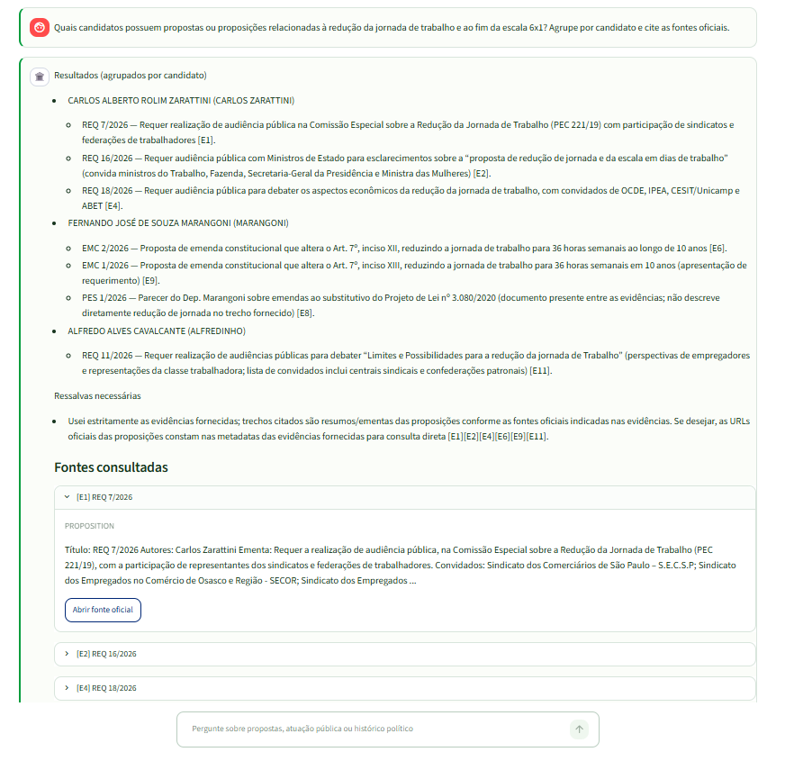
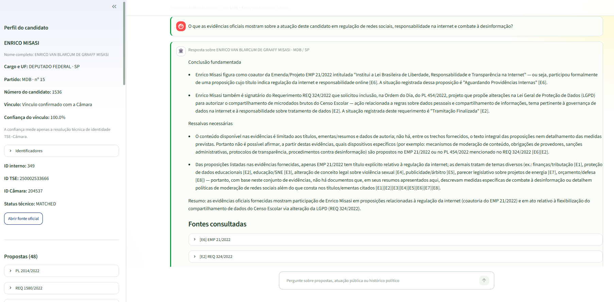

# 🗳️ IRIS Political Insight

## 🌐 Introdução

O **IRIS Political Insight** é uma plataforma de consulta e análise de dados públicos eleitorais e parlamentares brasileiros. Construída com **InterSystems IRIS**, **Hybrid Search** e **RAG (Retrieval-Augmented Generation)**, ela integra, estrutura, relaciona, indexa, recupera e contextualiza evidências oficiais do **Tribunal Superior Eleitoral (TSE)** e da **Câmara dos Deputados**, com rastreabilidade até a fonte.


> **O Brasil está em campanha para as Eleições Gerais de 2026. E se explorar dados eleitorais públicos fosse tão simples quanto fazer uma pergunta?**

[English version](https://raw.githubusercontent.com/Davi-Massaru/rag-iris-brasil-tse/refs/heads/main/README.md) · [Pipeline técnica](https://raw.githubusercontent.com/Davi-Massaru/rag-iris-brasil-tse/refs/heads/main/PIPELINE.pt.md) · [Artigo em português](https://raw.githubusercontent.com/Davi-Massaru/rag-iris-brasil-tse/refs/heads/main/ARTICLE.pt.md)

Em **4 de outubro de 2026**, **158.745.463 eleitoras e eleitores** estarão aptos a participar das Eleições Gerais no Brasil, escolhendo representantes para **seis cargos eletivos**: Presidência da República, governos estaduais, Senado Federal, Câmara dos Deputados, assembleias legislativas e, no Distrito Federal, a Câmara Legislativa. Com **segundo turno para presidente da República e governadores** será realizado em **25 de outubro**. Fonte: [Tribunal Superior Eleitoral (TSE)](https://www.tse.jus.br/comunicacao/noticias/2026/Julho/mais-de-158-milhoes-de-eleitores-estao-aptos-votar-nas-eleicoes-2026).

O Brasil publica uma quantidade expressiva de dados sobre candidaturas e atuação parlamentar. O desafio é transformar arquivos, APIs, identificadores e documentos distribuídos em informação que uma pessoa consiga realmente explorar.

Dados públicos não significam, por si só, informação acessível. Uma investigação pode exigir conhecimento de APIs governamentais, ZIP, CSV, PDFs, SQL, identificadores diferentes para a mesma pessoa e vários sistemas oficiais. A proposta é reduzir essa barreira sem substituir as fontes originais.

## 💡 A solução

O projeto aproxima duas dimensões complementares:

- o **TSE** fornece o contexto eleitoral: candidaturas, cargo, partido, UF e propostas de governo quando disponíveis;
- a **Câmara dos Deputados** fornece contexto parlamentar para candidaturas vinculadas com segurança: histórico, mandatos externos, proposições, autores e temas.

Uma candidatura informa quem está concorrendo. Dados legislativos podem acrescentar contexto sobre quem já exerceu mandato como deputado federal. O vínculo entre as bases é determinístico, auditável e só aciona a coleta parlamentar quando classificado como <code>MATCHED</code>.

Sobre essa base, o sistema combina filtros estruturados, busca lexical e similaridade vetorial; recupera evidências; enriquece cada trecho com dados da entidade de origem; e pede ao modelo de linguagem uma síntese limitada ao contexto recuperado.

## 🧭 Princípios do projeto

O sistema não tenta responder:

> Qual é o melhor candidato?

O objetivo é responder perguntas exploratórias por RAG:

> "O que as fontes oficiais disponíveis apresentam sobre esse candidato e sobre o tema pesquisado?"
>
> “Qual é a posição deste candidato sobre a proteção de crianças e adolescentes na internet?”
>
> “Este candidato apresenta propostas para combater a violência nas escolas? Quais são?”
>
> “Quais candidatos possuem propostas relacionadas à redução da jornada de trabalho 6x1?”
>
> “Quais candidatos apresentam propostas para regulamentação de redes sociais e combate à desinformação?”
>
> “Quais candidatos possuem propostas relacionadas ao uso de inteligência artificial no setor público?”

Estas perguntas correspondem a caminhos presentes na implementação. A resposta depende do recorte ingerido e das evidências disponíveis.

A aplicação não:

- recomenda voto;
- classifica candidatos;
- atribui score político;
- prevê resultados eleitorais;
- determina automaticamente ideologia;
- substitui a leitura das fontes originais.

O sistema fornece **informação + contexto + evidências**.

## 🏗️ Arquitetura

O fluxo implementado é **coletar → validar → relacionar → persistir → dividir → representar → recuperar → contextualizar → explicar**.

```text
                    Fontes públicas

              TSE              Câmara
               │                  │
               └────────┬─────────┘
                        │
                    Ingestão
                        │
                        ▼
               InterSystems IRIS
          ┌─────────────┼─────────────┐
          │             │             │
          ▼             ▼             ▼
      Candidate     Proposition   PoliticalChunk
      Relacional     Relacional      VECTOR
          │             │             │
          └─────────────┼─────────────┘
                        │
                 Hybrid Search
               ┌────────┴────────┐
               │                 │
          Keyword Search    Vector Search
               │                 │
               └────────┬────────┘
                        │
                       RRF
                        │
                     Top K
                        │
                       LLM
                        │
                        ▼
                 Resposta + fontes
```

Não existe container <code>api</code> nem Waitress. O IRIS serve a API Flask; o segundo container contém somente a interface Streamlit U.I.

## 🧩 Implementações no ecossistema IRIS

| Capacidade | Uso efetivo |
|---|---|
| Classes persistentes | Oito classes <code>%Persistent</code> modelam candidaturas, histórico, proposições, autores, temas, documentos, chunks e execuções. |
| SQL | Filtros, agregações, relacionamentos, contexto estruturado e auditoria usam SQL parametrizado. |
| Object API | Embedded Python usa <code>_OpenId()</code>, <code>_New()</code> e <code>_Save()</code> em operações pontuais de <code>Candidate</code> e <code>IngestionRun</code>. |
| Streams | PDFs extraídos e JSON de histórico ficam em <code>%Stream.GlobalCharacter</code>. |
| Vector Search | Embeddings de 1.536 dimensões ficam em <code>%Vector</code>; o IRIS calcula <code>VECTOR_COSINE</code>. |
| Multimodelo | Relações, objetos, streams e vetores compõem uma base, sem banco vetorial separado. |
| Embedded Python | Ingestão, API, retrieval e RAG executam no namespace <code>IRISAPP</code>. |
| WSGI nativo | O Web Gateway hospeda Flask por <code>%SYS.Python.WSGI</code> em <code>/api</code>. |
| Transações/auditoria | Commit, rollback e <code>IngestionRun</code> tornam o processo observável e repetível. |

SQL responde ao que é determinístico, streams preservam documentos, vetores aproximam significados e o contexto RAG reúne essas representações no núcleo IRIS.

## 🔎 RAG + Hybrid Search

Dados eleitorais contêm nomes, siglas, partidos, UFs, cargos, números e IDs que exigem correspondência exata. Perguntas humanas também expressam o mesmo conceito com palavras diferentes.

| Mecanismo | Papel |
|---|---|
| Busca lexical | Favorece frase exata e termos após normalização de caixa e acentos. |
| Vector Search | Usa o embedding da pergunta e <code>VECTOR_COSINE</code> no IRIS. |
| Hybrid Search | Combina os rankings por RRF (<code>k=60</code>), sem misturar scores incompatíveis. |
| RAG | Entrega evidências ao LLM para produzir uma síntese citada e condicionada às fontes. |

O LLM não é chamado quando não há evidência válida. O prompt exige linguagem neutra, uso exclusivo dos blocos <code>[E1]</code>, <code>[E2]</code>, citações e declaração de contexto insuficiente. RAG não elimina alucinações; busca reduzi-las ao condicionar a geração ao material recuperado.

## 🏛️ Fontes oficiais

| Fonte | Conteúdo | Acesso |
|---|---|---|
| [Dados Abertos do TSE](https://dadosabertos.tse.jus.br/dataset/candidatos-2026) | Candidaturas e propostas de governo de 2026 quando disponíveis | CKAN, ZIP, CSV Latin-1 e PDFs |
| [Dados Abertos da Câmara](https://dadosabertos.camara.leg.br/) | Deputados, histórico, mandatos, proposições, autores e temas | REST v2 JSON paginada |

Cada chunk conserva tipo, ID externo, URL oficial, candidato, metadados, hash e trecho.

## ⚙️ Pipeline de dados

Um comando executa candidatos do TSE, propostas de governo, associação/coleta da Câmara e índice RAG. Downloads são validados, gravações são idempotentes, chunks usam 700 tokens com overlap 100 e <code>text-embedding-3-small</code> produz 1.536 dimensões.

Consulte **[PIPELINE.pt.md](https://raw.githubusercontent.com/Davi-Massaru/rag-iris-brasil-tse/refs/heads/main/PIPELINE.pt.md)** para contratos, matching, transações, paginação, hashes, falhas, chunking e retrieval. O README não duplica essa documentação.

## 🧪 Demonstração reproduzível

Após a ingestão, abra <code>http://localhost:8501</code>, escolha um candidato — ou “Todos os candidatos” — e pergunte. A interface exibe resposta e fontes.

### Exemplos da interface

**Consulta geral — todos os candidatos.** A busca identifica candidaturas com evidências relacionadas à redução da jornada de trabalho, organiza o resultado por candidato e mantém as referências oficiais usadas na resposta.



**Consulta específica.** Com uma candidatura selecionada, a aplicação reúne o perfil eleitoral, o vínculo confirmado com a Câmara e evidências parlamentares sobre regulação da internet, proteção de dados e desinformação.



Teste o fluxo pela API sem escolher um ID manualmente:

~~~powershell
$candidates = Invoke-RestMethod http://localhost:52773/api/candidates
$candidate = $candidates.items | Select-Object -First 1
$body = @{ question = "Quais temas aparecem com maior frequência nas proposições deste candidato?"; candidateId = [int]$candidate.id } | ConvertTo-Json
Invoke-RestMethod -Method Post -Uri http://localhost:52773/api/ask -ContentType "application/json" -Body $body
~~~

~~~text
pergunta
  → planejamento determinístico
  → consulta estruturada ou Hybrid Search
  → chunk + dados estruturados da origem
  → contexto [E1]...[En]
  → LLM
  → resposta + sources[] com URL oficial
~~~

O repositório não contém screenshots; por isso, não apresentamos uma resposta pré-fabricada como resultado real. Saídas variam com recorte, coleta e dados oficiais.

## 🚀 Executando o projeto

### 📋 Requisitos

- Docker com Compose v2;
- acesso a <code>intersystems/iris-community:latest-cd</code>;
- chave OpenAI para embeddings, busca vetorial e <code>/ask</code>;
- portas <code>1972</code>, <code>52773</code> e <code>8501</code> livres;
- Python 3.12 somente para desenvolvimento/testes no host.

### 1. 📥 Clonar

Este checkout não possui <code>origin</code> configurado; use a URL HTTPS exibida na página publicada:

~~~powershell
$repositoryUrl = Read-Host "URL HTTPS do repositório"
git clone $repositoryUrl
Set-Location tse-iris-rag
~~~

### 2. 🔧 Configurar

~~~powershell
Copy-Item .env.example .env
notepad .env
~~~

Em Linux/macOS, use <code>cp .env.example .env</code>. Preencha ao menos:

~~~dotenv
LLM_API_KEY=sua-chave-openai
~~~

O exemplo usa eleição 2026, UF <code>SP</code> e os cargos de <code>INGEST_OFFICES</code>. Reduza UFs, cargos e limites da Câmara se desejar uma carga menor.

### 3. 🏗️ Build e inicialização

~~~powershell
docker compose up --build -d
docker compose ps
~~~

Espere <code>iris</code> saudável e <code>ui</code> em execução.

### 4. ❤️ Health checks

~~~powershell
Invoke-RestMethod http://localhost:52773/api/health
Invoke-WebRequest -UseBasicParsing http://localhost:8501/_stcore/health
~~~

Resultados: <code>{"status":"ok"}</code> e <code>ok</code>.

### 5. 📦 Ingestão

~~~powershell
docker compose exec iris irispython -m app.ingestion.pipeline
~~~

O comando consulta serviços públicos e gera embeddings; duração e volume variam. Para reconstruir apenas chunks/embeddings já persistidos:

~~~powershell
docker compose exec -T iris irispython -m app.ingestion.chunk_index
~~~

### 6. ✅ Validação e acesso

~~~powershell
Invoke-RestMethod http://localhost:52773/api/candidates
~~~

- interface: <code>http://localhost:8501</code>
- API: <code>http://localhost:52773/api</code>

### 7. 🧪 Testes locais

~~~powershell
python -m venv .venv
.\.venv\Scripts\Activate.ps1
python -m pip install -r requirements-dev.txt
pytest -m unit
ruff check app tests wsgi_app.py
mypy app wsgi_app.py
~~~

Integração e smoke exigem IRIS/Docker ativos e as variáveis <code>RUN_IRIS_TESTS=1</code> e <code>RUN_SMOKE_TESTS=1</code>, respectivamente.

## 🛠️ Troubleshooting essencial

| Sintoma | Ação |
|---|---|
| IRIS não saudável | <code>docker compose logs --tail 200 iris</code> |
| API 500 | <code>docker compose exec -T iris sh -lc "tail -100 /usr/irissys/mgr/WSGI.log"</code> |
| Lista de candidatos vazia | Execute a pipeline e confira chave, filtros <code>INGEST_*</code> e logs. |
| <code>RAG_INDEX</code> parcial | Confirme a chave; podem existir chunks sem embedding. |
| UI sem API | Container usa <code>http://iris:52773/api</code>; host usa <code>http://localhost:52773/api</code>. |
| Código WSGI antigo | Reconstrua/recrie <code>iris</code>; módulos podem estar em cache. |

<code>docker compose down</code> preserva o volume. <code>docker compose down -v</code> **apaga os dados do IRIS**.

## 📁 Estrutura

~~~text
app/
├── api/          # Flask e contratos HTTP
├── config/       # configuração validada
├── database/     # SQL, DB-API, Object API e transações
├── embeddings/   # embeddings
├── ingestion/    # TSE, Câmara, matching e chunking
├── rag/          # contexto, prompt e geração
├── repositories/ # persistência IRIS
├── retrieval/    # estruturada, lexical, vetorial e RRF
└── ui/           # Streamlit
iris/             # oito classes ObjectScript
tests/            # unitários, integração e smoke
docs/             # especificações, decisões e auditorias
~~~

## 📚 Documentação

- [Pipeline técnica](https://raw.githubusercontent.com/Davi-Massaru/rag-iris-brasil-tse/refs/heads/main/PIPELINE.pt.md)
- [Especificação](https://raw.githubusercontent.com/Davi-Massaru/rag-iris-brasil-tse/refs/heads/main/docs/SPEC%20%E2%80%94%20IRIS%20Political%20Insight.md)
- [Plano de implementação](https://raw.githubusercontent.com/Davi-Massaru/rag-iris-brasil-tse/refs/heads/main/docs/IMPLEMENTATION_PLAN.md)
- [Ingestão TSE + Câmara + IRIS](https://raw.githubusercontent.com/Davi-Massaru/rag-iris-brasil-tse/refs/heads/main/docs/IMPLEMENTACAO_INGESTAO_TSE_CAMARA_IRIS.md)
- [Classes IRIS e mapeamento](https://raw.githubusercontent.com/Davi-Massaru/rag-iris-brasil-tse/refs/heads/main/docs/CLASSES_IRIS_E_MAPEAMENTO_INGESTAO_ATUAL.md)
- [Migração WSGI](https://raw.githubusercontent.com/Davi-Massaru/rag-iris-brasil-tse/refs/heads/main/docs/MIGRACAO_FLASK_WAITRESS_PARA_IRIS_WSGI.md)
- [Artigo técnico](https://raw.githubusercontent.com/Davi-Massaru/rag-iris-brasil-tse/refs/heads/main/ARTICLE.pt.md)

## 🏆 Concurso InterSystems 2026

O projeto concorre no tópico **RAG** do [Concurso InterSystems PT 2026](https://pt.community.intersystems.com/post/concurso-de-programa%C3%A7%C3%A3o-da-comunidade-de-desenvolvedores-da-intersystems-pt-2026).

| Critério | Evidência | Situação |
|---|---|---|
| RAG | Retrieval → contexto → prompt → Responses API → resposta com fontes | Implementado |
| Hybrid Search | Lexical + vetorial combinados por RRF | Implementado |
| Vector Search | <code>%Vector(DOUBLE, 1536)</code> + <code>VECTOR_COSINE</code> | Implementado |
| APIs públicas | TSE CKAN e Câmara REST v2 | Implementado |
| Dados multimodelo | Relacional/objetos + streams + vetores no IRIS | Implementado |
| Chunking | 700/100 tokens, hash, proveniência e páginas | Implementado e analisado |
| Embeddings | <code>text-embedding-3-small</code>, mesmo modelo para corpus e consulta | Implementado e analisado |
| Pipeline explícito | Ingestão, chunking, vetor, retrieval, prompt e geração | Implementado e documentado |
| WSGI nativo | <code>%SYS.Python.WSGI</code> em <code>/api</code> | Implementado; o bônus formal está no tópico PyProd |

O método de desenvolvimento com OpenAI Codex, prompts-especificação, revisão humana e correções reais está em [ARTICLE.pt.md](https://raw.githubusercontent.com/Davi-Massaru/rag-iris-brasil-tse/refs/heads/main/ARTICLE.pt.md).

## ⚖️ Licença e responsabilidade

Código sob [licença MIT](https://raw.githubusercontent.com/Davi-Massaru/rag-iris-brasil-tse/refs/heads/main/LICENSE).

Projeto independente, sem vínculo com TSE, Câmara, candidaturas ou partidos. Organiza informações públicas e não substitui fontes oficiais nem o julgamento do eleitor.

## 👤 Autor

- [LinkedIn](https://www.linkedin.com/in/davimassarumuta/)
- [InterSystems Developer Community](https://community.intersystems.com/user/davimassaru-teixeiramuta)
- [InterSystems Open Exchange](https://openexchange.intersystems.com/user/Davi%20Massaru%20Teixeira%20Muta/ygbBNKanLnVDa9ffzk64UznaE)
