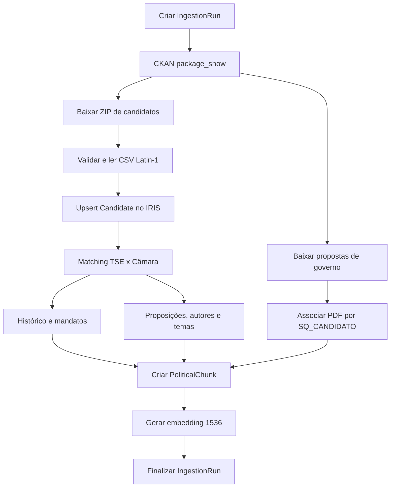
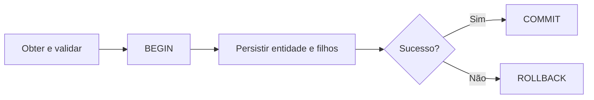
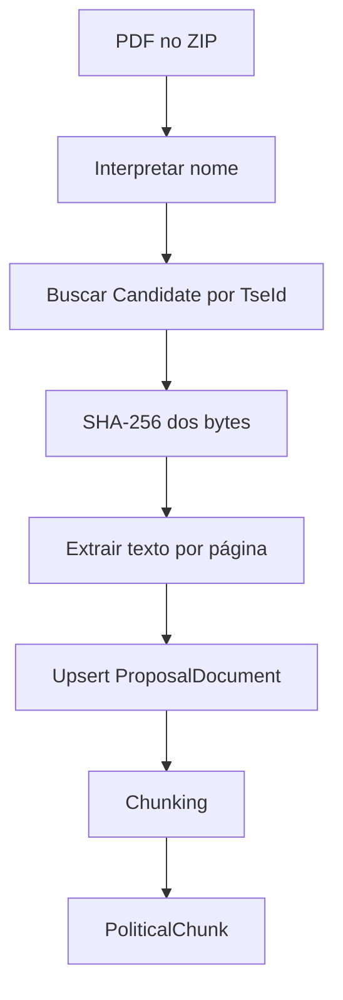

# Implementação da Ingestão TSE + Câmara no InterSystems IRIS

> **Projeto:** TSE Public Data RAG Explorer
> **Pacote persistente:** `IRISPolitical.Model`
> **Fontes:** Tribunal Superior Eleitoral e Câmara dos Deputados
> **Ano eleitoral:** 2026
> **Contratos verificados em:** 22/08/2026
> **Idioma:** PT-BR

---

## 1. Objetivo

Este documento define a implementação do processo que:

1. descobre e baixa os recursos oficiais do TSE;
2. lê candidatos do CSV eleitoral;
3. cadastra ou atualiza candidatos no InterSystems IRIS;
4. associa candidatos do TSE a deputados da Câmara;
5. obtém histórico parlamentar, mandatos externos e proposições;
6. persiste os dados nas classes `%Persistent` existentes;
7. extrai propostas de governo em PDF;
8. cria `PoliticalChunk` e grava embeddings compatíveis com o vetor do modelo atual;
9. registra a execução em `IngestionRun`.

O processo utiliza exclusivamente estas classes existentes:

```text
IRISPolitical.Model.Candidate
IRISPolitical.Model.PoliticalHistory
IRISPolitical.Model.Proposition
IRISPolitical.Model.PropositionAuthor
IRISPolitical.Model.PropositionTopic
IRISPolitical.Model.ProposalDocument
IRISPolitical.Model.PoliticalChunk
IRISPolitical.Model.IngestionRun
```

As classes `.cls` cuidam de estado, relacionamentos, índices e persistência. HTTP, ZIP, CSV, PDF, normalização, matching, chunking e embeddings permanecem na aplicação Python.

---

## 2. Decisões confirmadas nos contratos oficiais

### 2.1 TSE

- o portal do TSE expõe uma API CKAN para descoberta de datasets e recursos;
- a API CKAN não entrega os candidatos linha a linha;
- o recurso `Candidatos` é um ZIP que contém CSVs por UF, um CSV nacional e o `leiame.pdf`;
- o CSV oficial usa codificação Latin-1, campos entre aspas e separador `;`;
- `SQ_CANDIDATO` é a chave de cruzamento da candidatura e não é o número de urna;
- propostas de governo são recursos ZIP separados por UF e por `BR`;
- o nome de cada PDF contém o ano, a UF, o `SQ_CANDIDATO` e a sequência do documento.

### 2.2 Câmara dos Deputados

- a API usa a base `https://dadosabertos.camara.leg.br/api/v2`;
- as requisições do projeto usam `Accept: application/json`;
- respostas de coleção usam o envelope `{ "dados": [], "links": [] }`;
- respostas unitárias usam `{ "dados": {}, "links": [] }`;
- listagens retornam 15 itens por padrão e aceitam no máximo 100 por requisição;
- a primeira página é `1`;
- a paginação deve seguir o link com `rel = "next"`;
- `GET /deputados` sem `idLegislatura`, `dataInicio` ou `dataFim` retorna somente deputados em exercício no momento da requisição;
- o OpenAPI oficial consultado informa a versão interna `0.4.344`, de 18/08/2026.

---

## 3. Fluxo consolidado



### 3.1 Limites de transação

As chamadas HTTP e a leitura de arquivos acontecem fora de transações do IRIS. A transação é aberta somente quando os DTOs internos já estão validados.



Unidades transacionais:

- candidatos TSE: lote de até 500 candidatos;
- dados da Câmara: um candidato por transação;
- proposições: uma proposição e seus autores/temas por transação;
- proposta de governo: um PDF e seus chunks por transação;
- embedding: atualização de um lote de chunks já persistidos.

---

## 4. Estrutura Python

```text
app/
├── config/
│   └── settings.py
├── database/
│   ├── iris_connection.py
│   └── transaction.py
├── ingestion/
│   ├── tse/
│   │   ├── client.py
│   │   ├── contracts.py
│   │   ├── parser.py
│   │   ├── proposal_reader.py
│   │   └── mapper.py
│   ├── camara/
│   │   ├── client.py
│   │   ├── contracts.py
│   │   ├── pagination.py
│   │   └── mapper.py
│   ├── matching/
│   │   └── candidate_matcher.py
│   ├── chunking/
│   │   └── political_chunk_builder.py
│   └── pipeline.py
├── repositories/
│   ├── candidate_repository.py
│   ├── political_history_repository.py
│   ├── proposition_repository.py
│   ├── proposition_author_repository.py
│   ├── proposition_topic_repository.py
│   ├── proposal_document_repository.py
│   ├── political_chunk_repository.py
│   └── ingestion_run_repository.py
└── embeddings/
    └── embedder.py
```

Dependências funcionais:

```text
client -> contrato externo -> mapper -> DTO interno -> repository -> IRIS
```

O `client` não acessa o banco. O `repository` não realiza chamadas HTTP.

---

## 5. Configuração

```env
IRIS_HOST=localhost
IRIS_PORT=1972
IRIS_NAMESPACE=USER
IRIS_USERNAME=_SYSTEM
IRIS_PASSWORD=SYS
IRIS_SQL_SCHEMA=IRISPolitical_Model

TSE_CKAN_BASE_URL=https://dadosabertos.tse.jus.br/api/3/action
TSE_DATASET_ID=candidatos-2026
TSE_PORTAL_URL=https://dadosabertos.tse.jus.br/dataset/candidatos-2026

CAMARA_BASE_URL=https://dadosabertos.camara.leg.br/api/v2
CAMARA_MATCH_START_DATE=2000-01-01
CAMARA_PAGE_SIZE=100

INGEST_ELECTION_YEAR=2026
INGEST_STATES=SP
INGEST_OFFICES=DEPUTADO FEDERAL,GOVERNADOR

HTTP_CONNECT_TIMEOUT_SECONDS=10
HTTP_READ_TIMEOUT_SECONDS=60
HTTP_MAX_RETRIES=4

CHUNK_SIZE_TOKENS=700
CHUNK_OVERLAP_TOKENS=100
EMBEDDING_DIMENSION=1536
EMBEDDING_MODEL=
```

`IRIS_SQL_SCHEMA` deve receber o schema SQL efetivamente gerado após a compilação das classes. Com o pacote atual, o valor esperado é `IRISPolitical_Model`; `SqlTableName` define os nomes `Candidate`, `Proposition`, `PoliticalChunk` etc.

Os filtros de UF e cargo são aplicados depois da leitura e normalização do CSV. Eles não alteram o contrato externo.

---

## 6. Fonte TSE: API CKAN

### 6.1 Descoberta do dataset

```http
GET /package_show?id=candidatos-2026 HTTP/1.1
Host: dadosabertos.tse.jus.br
Accept: application/json
```

URL completa:

```text
https://dadosabertos.tse.jus.br/api/3/action/package_show?id=candidatos-2026
```

Não há autenticação.

Contrato mínimo consumido:

```json
{
  "success": true,
  "result": {
    "id": "ba2d7d69-5bf5-4379-8c91-664c11f75a2e",
    "name": "candidatos-2026",
    "title": "Candidatos - 2026",
    "metadata_modified": "2026-08-18T15:11:00.448100",
    "resources": [
      {
        "id": "uuid",
        "name": "Candidatos",
        "format": "CSV",
        "mimetype": "application/zip",
        "url": "https://cdn.tse.jus.br/.../consulta_cand_2026.zip",
        "state": "active"
      }
    ]
  }
}
```

Contrato Python:

```python
@dataclass(frozen=True)
class TseResource:
    id: str
    name: str
    format: str
    mimetype: str | None
    url: str
    state: str

@dataclass(frozen=True)
class TseDataset:
    id: str
    name: str
    title: str
    metadata_modified: str | None
    resources: list[TseResource]
```

Validações obrigatórias:

```text
HTTP 200
payload.success == true
payload.result.name == TSE_DATASET_ID
resources é uma lista
recurso selecionado possui state == active
recurso selecionado possui URL HTTPS em domínio oficial do TSE
```

### 6.2 Seleção dos recursos

Não selecionar recurso pela posição no array.

```python
candidate_resource = next(
    resource
    for resource in dataset.resources
    if resource.name == "Candidatos"
    and resource.format.upper() == "CSV"
    and resource.state == "active"
)

proposal_resources = [
    resource
    for resource in dataset.resources
    if resource.name.endswith(" - Proposta de governo")
    and resource.format.upper() == "PDF"
    and resource.state == "active"
]
```

Recursos confirmados na verificação:

| Recurso | ID CKAN | Distribuição |
|---|---|---|
| Candidatos | `7748de82-a23b-47c4-9ec1-35535d945e5b` | `consulta_cand_2026.zip` |
| BR - Proposta de governo | `433ac1f4-07dc-44a2-bcbe-c87a2073721a` | `proposta_governo_2026_BR.zip` |
| SP - Proposta de governo | `c8f84a67-6683-4d69-b1b3-64c24d0c797b` | `proposta_governo_2026_SP.zip` |

A seleção em execução sempre usa o resultado atual do CKAN. Os IDs acima servem para teste de contrato e diagnóstico.

---

## 7. TSE: contrato físico do arquivo de candidatos

### 7.1 Download

Recurso de 2026:

```text
https://cdn.tse.jus.br/estatistica/sead/odsele/consulta_cand/consulta_cand_2026.zip
```

Passos:

1. baixar em streaming para arquivo temporário;
2. exigir HTTP 200;
3. limitar redirecionamentos a HTTPS;
4. calcular SHA-256 durante o download;
5. validar que o arquivo é ZIP;
6. rejeitar membros com caminho absoluto ou `..`;
7. localizar o CSV da UF ou o consolidado `consulta_cand_2026_BRASIL.csv`;
8. validar o cabeçalho antes de processar registros;
9. registrar o hash do ZIP em `IngestionRun.SourceHash`.

### 7.2 Formato oficial

```text
encoding: latin-1 / ISO-8859-1
delimiter: ;
quotechar: "
primeira linha: cabeçalho
```

Não tentar UTF-8 antes de Latin-1. O `leiame.pdf` incluído pelo TSE declara explicitamente a codificação Latin-1.

Valores especiais:

| Valor TSE | Significado | Normalização |
|---|---|---|
| `#NULO` | informação vazia | `None` |
| `-1` em campo numérico | informação vazia | `None` |
| `#NE` | informação não registrada naquele ano | `None` |
| `-3` em campo numérico | informação não registrada | `None` |
| `NÃO DIVULGÁVEL` | dado pessoal não publicável | `None` |
| `-4` em campo numérico | candidato não divulgável | `None` |

`SG_UF` pode conter uma UF, `BR`, `VT` ou `ZZ`. A classe atual aceita dois caracteres; o filtro da ingestão decide quais valores entram no MVP.

### 7.3 Colunas consumidas

O arquivo possui outras colunas, mas o domínio consome apenas:

| Coluna TSE | Tipo após normalização | Uso |
|---|---:|---|
| `ANO_ELEICAO` | `int` | filtro e proposta de governo |
| `SG_UF` | `str` | `Candidate.State` |
| `CD_CARGO` | `int \| None` | validação/filtro |
| `DS_CARGO` | `str` | `Candidate.Office` |
| `SQ_CANDIDATO` | `str` | `Candidate.TseId` |
| `NR_CANDIDATO` | `int \| None` | `Candidate.CandidateNumber` |
| `NM_CANDIDATO` | `str` | `Candidate.Name` |
| `NM_URNA_CANDIDATO` | `str \| None` | `Candidate.BallotName` |
| `NR_PARTIDO` | `int \| None` | `Candidate.PartyNumber` |
| `SG_PARTIDO` | `str \| None` | `Candidate.Party` |

`SQ_CANDIDATO` permanece `str`; não converter a chave externa para `int`.

Dados pessoais como CPF, título eleitoral, data de nascimento e e-mail não são persistidos.

### 7.4 Contrato Python

```python
@dataclass(frozen=True)
class TseCandidateRaw:
    election_year: int
    state: str
    office_code: int | None
    office_name: str
    candidate_sequence: str
    candidate_number: int | None
    candidate_name: str
    ballot_name: str | None
    party_number: int | None
    party_abbreviation: str | None
```

Campos obrigatórios antes do mapper:

```text
ANO_ELEICAO
SG_UF
DS_CARGO
SQ_CANDIDATO
NM_CANDIDATO
```

Registro sem algum desses campos é rejeitado, incrementa `RecordsFailed` e produz log com número da linha e motivo, sem registrar dados pessoais.

### 7.5 Mapeamento para `Candidate`

| Origem | Destino IRIS | Regra |
|---|---|---|
| `SQ_CANDIDATO` | `TseId` | chave funcional, texto |
| `NM_CANDIDATO` | `Name` | `strip`, preservar acentos |
| `NM_URNA_CANDIDATO` | `BallotName` | `strip`, opcional |
| `SG_PARTIDO` | `Party` | `strip`, uppercase |
| `NR_PARTIDO` | `PartyNumber` | inteiro opcional |
| `DS_CARGO` | `Office` | `strip`, uppercase |
| `SG_UF` | `State` | uppercase |
| `NR_CANDIDATO` | `CandidateNumber` | inteiro opcional |
| URL do recurso CKAN | `SourceUrl` | URL oficial do recurso |
| fim do download | `SourceCollectedAt` | UTC |
| primeira inserção | `CreatedAt` | UTC |
| inserção/alteração | `UpdatedAt` | UTC |

O upsert consulta `Candidate` por `TseId`, protegido pelo índice único `TseIdIDX`.

```python
candidate_id = repository.find_id_by_tse_id(dto.tse_id)
if candidate_id is None:
    candidate_id = repository.insert(dto, now_utc)
else:
    repository.update(candidate_id, dto, now_utc)
```

Não alterar `CreatedAt` durante update.

---

## 8. TSE: propostas de governo

### 8.1 Contrato do pacote

Cada recurso de proposta é um ZIP contendo PDFs e um `leiame.pdf`.

Exemplos:

```text
proposta_governo_2026_SP.zip
proposta_governo_2026_BR.zip
```

Formato observado e documentado pelo TSE:

```text
YYYYUF<SQ_CANDIDATO>_<SEQUENCIA>.pdf
```

Regex da implementação:

```python
PROPOSAL_FILE_PATTERN = re.compile(
    r"^(?P<year>\d{4})(?P<state>BR|[A-Z]{2})"
    r"(?P<tse_id>\d+)_(?P<sequence>\d{2})\.pdf$",
    re.IGNORECASE,
)
```

Exemplo real de estrutura:

```text
SP/2026SP250002544912_01.pdf
SP/2026SP250002544912_02.pdf
```

O trecho numérico é o `SQ_CANDIDATO`; a associação não usa similaridade de nome.

### 8.2 Extração e persistência

Fluxo:



Mapeamento:

| Origem | `ProposalDocument` |
|---|---|
| `Candidate.%ID` encontrado por `TseId` | relacionamento `Candidate` |
| ano do nome do PDF | `ElectionYear` |
| `Proposta de governo - {BallotName ou Name} - documento {sequence}` | `Title` |
| página oficial do recurso CKAN | `SourceUrl` |
| UUID do recurso CKAN | `SourceResourceId` |
| caminho relativo do PDF no ZIP | `FileName` |
| SHA-256 dos bytes do PDF | `DocumentHash` |
| texto extraído em ordem de página | `RawText` |
| instante de download | `SourceCollectedAt` |

O upsert usa `Candidate + DocumentHash`, conforme `CandidateDocumentHashIDX`.

Se o PDF não contiver texto extraível:

- o `ProposalDocument` é persistido com `RawText` vazio;
- nenhum `PoliticalChunk` é criado para esse documento;
- `RecordsFailed` é incrementado com erro `PDF_TEXT_EXTRACTION_EMPTY`;
- a execução termina como `PARTIAL` se os demais itens forem concluídos.

Se o `TseId` do nome do arquivo não existir em `Candidate`, o PDF não é associado por aproximação. O item é rejeitado como `PROPOSAL_CANDIDATE_NOT_FOUND`.

---

## 9. Fonte Câmara: contrato HTTP comum

Base:

```text
https://dadosabertos.camara.leg.br/api/v2
```

Headers:

```http
Accept: application/json
User-Agent: tse-public-data-rag-explorer/1.0
```

Envelope de coleção:

```json
{
  "dados": [],
  "links": [
    {"rel": "self", "href": "https://..."},
    {"rel": "next", "href": "https://..."}
  ]
}
```

Envelope unitário:

```json
{
  "dados": {},
  "links": [
    {"rel": "self", "href": "https://..."}
  ]
}
```

Paginação:

```python
url = initial_url
params = {"pagina": 1, "itens": 100}

while url:
    payload = http.get(url, params=params).json()
    yield from payload["dados"]
    url = next(
        (link["href"] for link in payload["links"]
         if link["rel"] == "next"),
        None,
    )
    params = None
```

Seguir somente links HTTPS cujo host seja `dadosabertos.camara.leg.br`.

---

## 10. Endpoints da Câmara utilizados

| Endpoint | Função | Paginação |
|---|---|---|
| `GET /deputados` | localizar parlamentar | sim |
| `GET /deputados/{id}` | confirmar identidade | não |
| `GET /deputados/{id}/historico` | mudanças no exercício | não no contrato atual |
| `GET /deputados/{id}/mandatosExternos` | cargos eletivos externos | não no contrato atual |
| `GET /proposicoes?idDeputadoAutor={id}` | listar proposições do autor | sim |
| `GET /proposicoes/{id}` | detalhe da proposição | não |
| `GET /proposicoes/{id}/autores` | autores e apoiadores | não |
| `GET /proposicoes/{id}/temas` | temas oficiais | não |

Mesmo nos endpoints atualmente não paginados, o cliente valida `links` e aceita `rel = "next"` caso seja retornado.

---

## 11. Matching TSE x Câmara

### 11.1 Busca

Não filtrar por partido na chamada inicial. Um parlamentar pode ter trocado de partido e a própria documentação da Câmara alerta que siglas podem ser reutilizadas em legislaturas diferentes.

Requisição:

```http
GET /deputados?nome={nome}&siglaUf={uf}&dataInicio=2000-01-01&dataFim={hoje}&pagina=1&itens=100
Accept: application/json
```

Ordem de nomes consultados:

1. `Candidate.BallotName`;
2. primeiro e último termos relevantes de `Candidate.Name`, quando a primeira busca não retornar candidatos;
3. override manual, quando existente.

A resposta pode repetir o mesmo `id` para partidos ou legislaturas diferentes. Agrupar por `id` antes de chamar `/deputados/{id}`.

### 11.2 Contratos consumidos

Resumo de deputado:

```json
{
  "id": 123456,
  "uri": "https://dadosabertos.camara.leg.br/api/v2/deputados/123456",
  "nome": "NOME PARLAMENTAR",
  "siglaPartido": "ABC",
  "siglaUf": "SP",
  "idLegislatura": 57
}
```

Detalhe consumido:

```json
{
  "id": 123456,
  "nomeCivil": "NOME CIVIL",
  "ultimoStatus": {
    "nome": "NOME PARLAMENTAR",
    "nomeEleitoral": "NOME ELEITORAL",
    "siglaPartido": "ABC",
    "siglaUf": "SP",
    "idLegislatura": 57
  }
}
```

Não persistir CPF, e-mail, data de nascimento ou outros dados pessoais retornados pelo detalhe.

### 11.3 Normalização e pontuação

Normalização usada somente para comparação:

```text
Unicode NFKD
remoção de diacríticos
uppercase
remoção de pontuação
normalização de espaços
```

Manter os nomes originais nas entidades persistidas.

Pontuação:

| Critério | Pontos |
|---|---:|
| `Candidate.Name` igual a `nomeCivil` normalizado | 60 |
| `Candidate.BallotName` igual a `nome` ou `nomeEleitoral` | 20 |
| UF compatível | 15 |
| partido encontrado no histórico do parlamentar | 5 |

Resultado:

| Pontuação | `Candidate.MatchStatus` |
|---:|---|
| `>= 90` | `MATCHED` |
| `70..89` | `REVIEW` |
| `< 70` | `UNMATCHED` |

Persistência:

```text
Candidate.CamaraDeputyId = id da Câmara somente para MATCHED
Candidate.MatchStatus = MATCHED | REVIEW | UNMATCHED
Candidate.MatchConfidence = pontuação decimal
Candidate.UpdatedAt = now UTC
```

`REVIEW` não autoriza ingestão automática dos dados parlamentares. Um override validado pode promover o registro a `MATCHED`.

Arquivo de overrides consumido pela implementação:

```json
[
  {
    "tse_candidate_id": "250000123456",
    "camara_deputy_id": 123456,
    "verified": true,
    "reason": "Identidade conferida nas duas fontes oficiais"
  }
]
```

---

## 12. Câmara: histórico parlamentar

### 12.1 `GET /deputados/{id}/historico`

Contrato de item:

```json
{
  "id": 123456,
  "uri": "https://dadosabertos.camara.leg.br/api/v2/deputados/123456",
  "nome": "NOME PARLAMENTAR",
  "nomeEleitoral": "NOME ELEITORAL",
  "siglaPartido": "ABC",
  "siglaUf": "SP",
  "idLegislatura": 57,
  "dataHora": "2023-02-01T12:05",
  "situacao": "Exercício",
  "condicaoEleitoral": "Titular",
  "descricaoStatus": "Entrada - Posse"
}
```

Mapeamento para `PoliticalHistory`:

| Origem | Destino | Regra |
|---|---|---|
| `Candidate.%ID` | `Candidate` | relacionamento |
| valor fixo `CAMARA` | `Institution` | origem institucional |
| valor fixo `DEPUTADO FEDERAL` | `Position` | função do histórico |
| `siglaPartido` | `Party` | opcional |
| `siglaUf` | `State` | opcional |
| data de `dataHora` | `StartDate` | descartar hora somente no campo estruturado |
| ausência no contrato | `EndDate` | `NULL` |
| chave determinística | `ExternalId` | descrita abaixo |
| `situacao` ou `descricaoStatus` | `Situation` | primeiro não vazio |
| URL do endpoint | `SourceUrl` | URL oficial |
| item completo | `RawJson` | JSON canônico UTF-8 |

Chave:

```text
CAMARA_HIST:{deputy_id}:{idLegislatura}:{dataHora}
```

Se `dataHora` estiver ausente, usar:

```text
CAMARA_HIST:{deputy_id}:{sha256(canonical_json)}
```

O repository consulta por `Candidate + ExternalId` antes de inserir, pois `ExternalIdIDX` não é único no modelo atual.

### 12.2 `GET /deputados/{id}/mandatosExternos`

Contrato:

```json
{
  "cargo": "Vereador(a)",
  "siglaUf": "SP",
  "municipio": "Cidade",
  "anoInicio": "2009",
  "anoFim": "2016",
  "siglaPartidoEleicao": "ABC",
  "uriPartidoEleicao": "https://..."
}
```

Mapeamento:

| Origem | `PoliticalHistory` | Regra |
|---|---|---|
| valor fixo `CAMARA` | `Institution` | API fornecedora |
| `cargo` | `Position` | texto original |
| `siglaPartidoEleicao` | `Party` | opcional |
| `siglaUf` | `State` | opcional |
| `anoInicio` | `StartDate` | `AAAA-01-01` |
| `anoFim` | `EndDate` | `AAAA-12-31` |
| `Município: {municipio}` | `Situation` | quando houver município |
| item + metadado de precisão | `RawJson` | `datePrecision = YEAR` |

A aplicação apresenta esses campos somente como anos. As datas `01-01` e `12-31` são normalizações técnicas necessárias porque a classe atual usa `%Date`, enquanto a API fornece apenas o ano.

Chave determinística:

```text
CAMARA_EXT:{deputy_id}:{sha256(cargo|uf|municipio|anoInicio|anoFim|partido)[:48]}
```

---

## 13. Câmara: proposições

### 13.1 Listagem

```http
GET /proposicoes?idDeputadoAutor={id}&pagina=1&itens=100&ordem=ASC&ordenarPor=id
Accept: application/json
```

O filtro `idDeputadoAutor` faz a API considerar as proposições do autor mesmo sem tramitação nos últimos 30 dias. A paginação deve continuar até não existir `rel = "next"`.

Contrato resumido consumido:

```json
{
  "id": 2636332,
  "uri": "https://dadosabertos.camara.leg.br/api/v2/proposicoes/2636332",
  "siglaTipo": "PL",
  "codTipo": 139,
  "numero": 100,
  "ano": 2026,
  "ementa": "Texto da ementa",
  "dataApresentacao": "2026-04-13T00:00"
}
```

### 13.2 Detalhe

```http
GET /proposicoes/{id}
```

Campos consumidos do detalhe:

```json
{
  "id": 2636332,
  "uri": "https://.../proposicoes/2636332",
  "siglaTipo": "PL",
  "numero": 100,
  "ano": 2026,
  "ementa": "Texto da ementa",
  "ementaDetalhada": "Detalhamento",
  "dataApresentacao": "2026-04-13T00:00",
  "statusProposicao": {
    "descricaoSituacao": "Em tramitação",
    "descricaoTramitacao": "Apresentação de Proposição"
  }
}
```

O OpenAPI atual tipa a resposta de detalhe apenas como `object`. Por isso, o projeto mantém teste de contrato próprio para os campos acima e aceita campos opcionais ausentes ou `null`.

Mapeamento para `Proposition`:

| Câmara | IRIS | Regra |
|---|---|---|
| `id` | `CamaraId` | chave única |
| `siglaTipo` | `Type` | opcional |
| `numero` | `Number` | opcional |
| `ano` | `Year` | opcional |
| `{siglaTipo} {numero}/{ano}` | `Title` | usar somente partes disponíveis |
| `ementa` | `Summary` | opcional |
| `ementaDetalhada` | `DetailedSummary` | opcional |
| data de `dataApresentacao` | `PresentationDate` | ISO-8601 para `%Date` |
| `statusProposicao.descricaoSituacao` | `Status` | fallback para `descricaoTramitacao` |
| `uri` | `SourceUrl` | oficial |

O upsert usa `CamaraId`, protegido por `CamaraIdIDX` único.

### 13.3 Regra de relacionamento do modelo atual

`Proposition.Candidate` é um relacionamento único e `Proposition.CamaraId` também é único. Uma proposição com vários deputados autores não pode ser duplicada para vários candidatos nas classes atuais.

Para preservar consistência:

1. `Candidate` é definido somente na inserção da proposição;
2. uma reingestão nunca troca o candidato já relacionado;
3. se a mesma `CamaraId` aparecer para outro candidato, a proposição global, seus autores e temas são atualizados, mas o relacionamento existente é mantido;
4. o caso é contabilizado como `RecordsSkipped` com código `PROPOSITION_ALREADY_LINKED`.

Essa regra impede que a ordem de reexecução mova uma proposição de um candidato para outro.

---

## 14. Câmara: autores e temas

### 14.1 Autores

```http
GET /proposicoes/{id}/autores
```

Contrato:

```json
{
  "uri": "https://dadosabertos.camara.leg.br/api/v2/deputados/123456",
  "nome": "NOME DO AUTOR",
  "codTipo": 10000,
  "tipo": "Deputado(a)",
  "ordemAssinatura": 1,
  "proponente": 1
}
```

Mapeamento para `PropositionAuthor`:

| Câmara | IRIS | Regra |
|---|---|---|
| último segmento numérico de `uri` | `CamaraAuthorId` | `NULL` se URI não identificar deputado |
| `nome` | `Name` | obrigatório |
| `tipo` | `AuthorType` | opcional |
| `uri` | `Uri` | opcional |
| `proponente == 1` | `IsMainAuthor` | booleano |

O contrato da classe não possui campos para `codTipo` e `ordemAssinatura`; eles são usados durante o mapeamento, mas não são persistidos.

Como não há índice único para autor, o repository faz upsert por:

```text
Proposition + Uri
```

ou, quando `Uri` estiver ausente:

```text
Proposition + normalize(Name) + AuthorType
```

### 14.2 Temas

```http
GET /proposicoes/{id}/temas
```

Contrato:

```json
{
  "codTema": 34,
  "tema": "Administração Pública",
  "relevancia": 0
}
```

Mapeamento para `PropositionTopic`:

| Câmara | IRIS |
|---|---|
| `codTema` | `ExternalCode` |
| `tema` | `Name` |

O upsert usa `Proposition + Name`, protegido por `PropositionTopicUniqueIDX`. O campo `relevancia` não possui destino no modelo atual.

---

## 15. Repositories e persistência no IRIS

### 15.1 Conexão

A aplicação usa o driver DB-API do InterSystems IRIS, queries parametrizadas e transações explícitas.

```python
import iris

connection = iris.dbapi.connect(
    hostname=settings.iris_host,
    port=settings.iris_port,
    namespace=settings.iris_namespace,
    username=settings.iris_username,
    password=settings.iris_password,
)
```

O DB-API oficial expõe `iris.dbapi.connect()` e aceita esses parâmetros por nome ou por posição. As queries nunca concatenam valores recebidos das fontes externas.

### 15.2 Estratégia de upsert

O repository usa `SELECT ID` seguido de `INSERT` ou `UPDATE` dentro da mesma transação. Não depende de uma sintaxe de upsert específica do banco.

| Classe | Chave do repository | Proteção no modelo |
|---|---|---|
| `Candidate` | `TseId` | índice único |
| `PoliticalHistory` | `Candidate + ExternalId` | consulta do repository |
| `Proposition` | `CamaraId` | índice único |
| `PropositionAuthor` | `Proposition + Uri` ou nome normalizado | consulta do repository |
| `PropositionTopic` | `Proposition + Name` | índice único |
| `ProposalDocument` | `Candidate + DocumentHash` | índice único |
| `PoliticalChunk` | `Candidate + SourceType + SourceId + ChunkIndex + ContentHash` | índice único |

Exemplo lógico para `Candidate`:

```sql
SELECT ID
FROM IRISPolitical_Model.Candidate
WHERE TseId = ?
```

Inserção e atualização recebem todos os valores como parâmetros. O nome do schema vem exclusivamente de configuração validada, não de entrada externa.

### 15.3 Relacionamentos

Os repositories persistem o `%ID` do objeto pai na coluna SQL projetada pelo relacionamento:

```text
PoliticalHistory.Candidate       <- Candidate.%ID
Proposition.Candidate            <- Candidate.%ID
PropositionAuthor.Proposition    <- Proposition.%ID
PropositionTopic.Proposition     <- Proposition.%ID
ProposalDocument.Candidate       <- Candidate.%ID
PoliticalChunk.Candidate         <- Candidate.%ID
```

Antes do primeiro teste de integração, consultar `INFORMATION_SCHEMA.COLUMNS` para confirmar os nomes projetados pela compilação das classes no namespace configurado.

### 15.4 Datas e streams

Regras:

```text
CreatedAt: preencher apenas no INSERT
UpdatedAt: preencher em INSERT e UPDATE
SourceCollectedAt: instante em que a fonte foi obtida
todos os instantes técnicos: UTC
datas da fonte: preservar valor de calendário informado
```

`PoliticalHistory.RawJson` e `ProposalDocument.RawText` são `%Stream.GlobalCharacter`. O repository envia texto Unicode por parâmetro/CLOB; não divide streams em comandos SQL concatenados.

---

## 16. `IngestionRun`

Criar uma execução para cada fonte lógica:

```text
TSE_CANDIDATES
TSE_PROPOSALS
CAMARA
```

Início:

```text
Source = fonte lógica
StartedAt = now UTC
Status = RUNNING
contadores = 0
ParametersJson = parâmetros canônicos da execução
```

Finalização:

| Condição | Status |
|---|---|
| nenhum item falhou | `SUCCESS` |
| pelo menos um item falhou, mas houve persistência válida | `PARTIAL` |
| a fonte não pôde ser obtida ou nenhuma unidade pôde ser processada | `FAILED` |

`SourceHash`:

- ZIP de candidatos: SHA-256 do ZIP;
- ZIP de propostas: SHA-256 do ZIP;
- Câmara: `NULL`, pois a execução agrega várias respostas independentes.

`ErrorMessage` armazena somente o resumo técnico final, limitado ao tamanho da propriedade. Detalhes por item ficam nos logs estruturados.

Exemplo de `ParametersJson`:

```json
{
  "electionYear": 2026,
  "states": ["SP"],
  "offices": ["DEPUTADO FEDERAL", "GOVERNADOR"],
  "datasetId": "candidatos-2026",
  "pageSize": 100,
  "matchStartDate": "2000-01-01"
}
```

---

## 17. Criação dos `PoliticalChunk`

### 17.1 Identidade e origem

| Entidade | `SourceType` | `SourceId` |
|---|---|---|
| `Proposition` | `PROPOSITION` | `str(CamaraId)` |
| `ProposalDocument` | `GOVERNMENT_PROPOSAL` | `DocumentHash` |
| `PoliticalHistory` | `POLITICAL_HISTORY` | `ExternalId` |

`SourceId` não usa `%ID` quando existe identificador externo estável.

### 17.2 Conteúdo de proposição

```text
Título: PL 100/2026
Autores: Autor A; Autor B
Temas: Administração Pública; Educação
Ementa: ...
Ementa detalhada: ...
Situação: ...
```

Uma proposição curta gera um chunk com `ChunkIndex = 0`. Se o texto exceder o limite, usa o mesmo chunker de documentos.

### 17.3 Conteúdo de proposta de governo

- tamanho alvo: 700 tokens;
- overlap: 100 tokens;
- não ultrapassar `PoliticalChunk.Content MAXLEN = 32000`;
- preservar ordem das páginas;
- incluir página inicial/final em `MetadataJson` quando disponível.

### 17.4 Conteúdo de histórico

```text
Instituição: Câmara dos Deputados
Cargo/Função: Deputado Federal
Partido: ABC
UF: SP
Período: 2023
Situação: Exercício
```

Para mandatos externos, renderizar apenas os anos originais, não as datas técnicas `01-01` e `12-31`.

### 17.5 Hash e upsert

```python
content_hash = sha256(
    normalized_content.encode("utf-8")
).hexdigest()
```

Chave:

```text
Candidate + SourceType + SourceId + ChunkIndex + ContentHash
```

Se o conteúdo mudar, o novo hash produz um novo chunk. Antes da inserção dos chunks atuais de uma origem, o repository remove apenas chunks obsoletos da mesma combinação `Candidate + SourceType + SourceId` que não estejam no novo conjunto de hashes. A remoção acontece na mesma transação da inserção do novo conjunto.

### 17.6 Embedding

A classe atual exige:

```objectscript
Property Embedding As %Vector(DATATYPE = "DOUBLE", LEN = 1536);
```

Antes de persistir:

```python
if len(embedding) != 1536:
    raise EmbeddingDimensionError(
        expected=1536,
        actual=len(embedding),
    )
```

Campos atualizados:

```text
PoliticalChunk.Embedding
PoliticalChunk.EmbeddingModel
PoliticalChunk.TokenCount
PoliticalChunk.UpdatedAt
```

Falha no embedding não desfaz a persistência da origem nem do texto do chunk. O chunk permanece com `Embedding = NULL`, e a execução fica `PARTIAL`.

---

## 18. Pipeline principal

```python
def ingest_all(settings, repositories, clients, embedder):
    tse_dataset = clients.tse.get_dataset(settings.tse_dataset_id)

    ingest_tse_candidates(
        dataset=tse_dataset,
        filters=settings.candidate_filters,
        repositories=repositories,
    )

    ingest_tse_proposals(
        dataset=tse_dataset,
        states=settings.states,
        repositories=repositories,
    )

    candidates = repositories.candidates.list_for_camara_matching()

    for candidate in candidates:
        match = match_candidate(candidate, clients.camara)
        repositories.candidates.save_match(candidate.id, match)

        if match.status != "MATCHED":
            continue

        history = clients.camara.get_history(match.deputy_id)
        mandates = clients.camara.get_external_mandates(match.deputy_id)
        propositions = clients.camara.iter_propositions(match.deputy_id)

        persist_camara_data(
            candidate=candidate,
            match=match,
            history=history,
            mandates=mandates,
            propositions=propositions,
            repositories=repositories,
        )

    chunks = repositories.chunks.list_without_embedding()
    embed_chunks(chunks, embedder, repositories.chunks)
```

Cada função abre e finaliza seu próprio `IngestionRun` e atualiza os contadores conforme o resultado real dos repositories.

---

## 19. HTTP, repetição e erros

### 19.1 Repetição

Repetir somente:

```text
timeout de conexão
timeout de leitura
HTTP 429
HTTP 500, 502, 503 e 504
```

Política:

```text
máximo: 4 tentativas
backoff: 1s, 2s, 4s, 8s + jitter
respeitar Retry-After quando presente
```

Não repetir automaticamente HTTP 400 e erros de validação de contrato.

### 19.2 Classificação

| Situação | Ação |
|---|---|
| CKAN `success = false` | falhar `TSE_CANDIDATES`/`TSE_PROPOSALS` |
| ZIP inválido | falhar execução da fonte |
| cabeçalho TSE incompatível | falhar antes de persistir o lote |
| linha TSE inválida | rejeitar linha e continuar |
| Câmara 404 em detalhe individual | registrar item falho e continuar |
| Câmara 400 | registrar parâmetros e não repetir |
| Câmara 429/5xx | aplicar repetição |
| envelope sem `dados` ou `links` | erro de contrato |
| falha em uma proposição | rollback da proposição e continuar candidato |

Logs não incluem CPF, título eleitoral, e-mail pessoal ou corpo integral de PDFs.

---

## 20. Idempotência

Resultados exigidos ao executar duas vezes com as mesmas fontes:

```text
Candidate: nenhum duplicado por TseId
PoliticalHistory: nenhum duplicado por Candidate + ExternalId
Proposition: nenhum duplicado por CamaraId
PropositionAuthor: nenhum duplicado pela chave do repository
PropositionTopic: nenhum duplicado por Proposition + Name
ProposalDocument: nenhum duplicado por Candidate + DocumentHash
PoliticalChunk: nenhum duplicado pelo índice SourceChunkUniqueIDX
```

Na segunda execução, `CreatedAt` permanece inalterado e `UpdatedAt` muda somente quando houver update técnico ou de conteúdo.

---

## 21. Testes

### 21.1 Unidade

- parser Latin-1 com acentos;
- separador `;` e campos entre aspas;
- normalização de `#NULO`, `#NE`, `-1`, `-3`, `-4` e `NÃO DIVULGÁVEL`;
- rejeição de cabeçalho incompleto;
- seleção de recurso CKAN por nome/formato, sem índice do array;
- regex do PDF e extração exata do `SQ_CANDIDATO`;
- normalização de nomes sem alterar o valor original;
- agrupamento de resultados da Câmara por `id`;
- cálculo da pontuação e dos três `MatchStatus`;
- paginação por `links[rel=next]`;
- mapeamento de `proponente` para `IsMainAuthor`;
- dimensão de embedding igual a 1536;
- hashes determinísticos.

### 21.2 Contrato

Fixtures versionadas com respostas reduzidas de:

```text
TSE package_show
Câmara /deputados
Câmara /deputados/{id}
Câmara /deputados/{id}/historico
Câmara /deputados/{id}/mandatosExternos
Câmara /proposicoes
Câmara /proposicoes/{id}
Câmara /proposicoes/{id}/autores
Câmara /proposicoes/{id}/temas
```

Os testes validam somente os campos consumidos e aceitam campos extras.

### 21.3 Integração com IRIS

- compilar as oito classes;
- confirmar schema, tabelas e colunas em `INFORMATION_SCHEMA`;
- inserir e atualizar `Candidate` por `TseId`;
- persistir relacionamentos usando `%ID` dos pais;
- persistir textos longos nos streams;
- validar os quatro índices únicos existentes;
- executar a mesma fixture duas vezes e comparar contagens;
- consultar `PoliticalChunk` com embedding de 1536 posições.

### 21.4 Smoke oficial

O smoke test executado manualmente antes de uma carga valida:

1. CKAN responde `success = true`;
2. o recurso `Candidatos` está `active`;
3. o ZIP abre e contém o cabeçalho mínimo;
4. OpenAPI da Câmara responde;
5. `/deputados?pagina=1&itens=1` retorna `dados` e `links`;
6. uma proposição conhecida retorna detalhe, autores e temas.

O smoke test não grava dados no IRIS.

---

## 22. Critérios de aceite

- candidatos do filtro configurado são persistidos em `Candidate`;
- `TseId` corresponde exatamente a `SQ_CANDIDATO`;
- reexecução não duplica candidatos;
- PDFs são associados pelo identificador do nome do arquivo;
- somente candidatos `MATCHED` recebem ingestão automática da Câmara;
- histórico e mandatos externos são persistidos com `RawJson` e proveniência;
- todas as páginas de proposições são consumidas;
- cada proposição recebe detalhe, autores e temas antes do commit;
- nenhuma proposição existente troca de candidato durante reingestão;
- chunks mantêm `SourceType`, `SourceId`, `SourceUrl`, `ContentHash` e metadados;
- embeddings persistidos possuem exatamente 1536 dimensões;
- toda execução termina com `SUCCESS`, `PARTIAL` ou `FAILED` em `IngestionRun`;
- logs e tabelas não armazenam os dados pessoais excluídos deste documento.

---

## 23. Referências oficiais

### Tribunal Superior Eleitoral

- [Portal de Dados Abertos do TSE](https://dadosabertos.tse.jus.br/)
- [Dataset Candidatos - 2026](https://dadosabertos.tse.jus.br/dataset/candidatos-2026)
- [API CKAN - package_show](https://dadosabertos.tse.jus.br/api/3/action/package_show?id=candidatos-2026)
- [Recurso Candidatos - 2026](https://dadosabertos.tse.jus.br/dataset/candidatos-2026/resource/7748de82-a23b-47c4-9ec1-35535d945e5b)
- [Download oficial consulta_cand_2026.zip](https://cdn.tse.jus.br/estatistica/sead/odsele/consulta_cand/consulta_cand_2026.zip)
- [Recurso BR - Proposta de governo](https://dadosabertos.tse.jus.br/dataset/candidatos-2026/resource/433ac1f4-07dc-44a2-bcbe-c87a2073721a)
- [Download oficial proposta_governo_2026_BR.zip](https://cdn.tse.jus.br/estatistica/sead/odsele/proposta_governo/proposta_governo_2026_BR.zip)

Os arquivos `leiame.pdf` usados para validar o leiaute estão incluídos nos próprios ZIPs oficiais.

### Câmara dos Deputados

- [Portal Dados Abertos da Câmara](https://dadosabertos.camara.leg.br/)
- [Swagger da API](https://dadosabertos.camara.leg.br/swagger/api.html)
- [OpenAPI JSON](https://dadosabertos.camara.leg.br/api/v2/api-docs)
- [Base da API v2](https://dadosabertos.camara.leg.br/api/v2/)

### InterSystems IRIS

- [Python DB-API Quick Reference](https://docs.intersystems.com/irislatest/csp/docbook/DocBook.UI.Page.cls?KEY=BPYDBAPI_refapi)
- [Definição de classes persistentes e projeção de pacotes para schemas](https://docs.intersystems.com/irislatest/csp/docbook/DocBook.UI.Page.cls?KEY=GOBJ_defpersobj)
- [Keyword SqlTableName](https://docs.intersystems.com/irislatest/csp/docbook/DocBook.UI.Page.cls?KEY=ROBJ_class_sqltablename)

---

## 24. Regra arquitetural final

```text
fonte externa
    -> contrato externo validado
    -> normalização
    -> DTO interno
    -> repository
    -> classe %Persistent
    -> InterSystems IRIS
```

Nenhum payload externo é persistido diretamente como entidade de domínio sem validação, normalização, chave de idempotência e proveniência.
